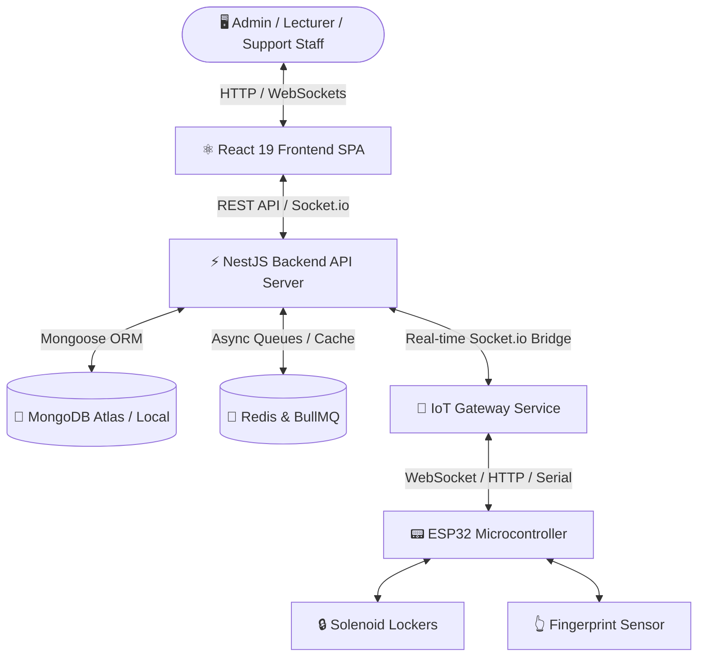

# 🏫 Smart Classroom & IoT Locker Management System
> **Hệ thống Quản lý Tủ đồ Thông minh & Phòng học Tích hợp IoT**
> *Dự án Quy mô Doanh nghiệp / Trường học - Đã áp dụng thực tế tại Đại học FPT Cần Thơ*

[](file:///c:/Users/admin/Desktop/DoAnTotNghiep/frontend)
[](file:///c:/Users/admin/Desktop/DoAnTotNghiep/backendAPI)
[](file:///c:/Users/admin/Desktop/DoAnTotNghiep/iot-gateway)
[](file:///c:/Users/admin/Desktop/DoAnTotNghiep/backendAPI)

---

## 📌 1. Giới thiệu Tổng quan (Project Overview)

**Smart Classroom & IoT Locker Management System** là hệ thống giải pháp công nghệ toàn diện kết hợp giữa **Web Application hiện đại** và **Mạng lưới thiết bị phần cứng IoT (ESP32)** nhằm tự động hóa quy trình quản lý phòng học, bàn giao chìa khóa/tủ đồ thông minh, mượn/trả phòng học và giám sát an ninh thời gian thực.

Dự án được thiết kế, phát triển và **áp dụng thực tế tại Đại học FPT Cần Thơ**, giải quyết bài toán vận hành quản lý chìa khóa phòng học cho hàng trăm giảng viên và nhân viên đào tạo mỗi ngày.

Hệ thống bao gồm 3 phân hệ chính được tổ chức độc lập:

1. **`backendAPI` (Server API & WebSockets)**: Phát triển bằng **NestJS 10 (TypeScript)** và MongoDB/Redis, chịu trách nhiệm xử lý logic nghiệp vụ, xác thực JWT & Google OAuth2, phát lệnh điều khiển tủ đồ và quản lý hàng chờ ngầm (BullMQ).
2. **`frontend` (Single Page Application)**: Xây dựng trên **React 19** và TailwindCSS/Radix UI, cung cấp giao diện trực quan cho Admin (Dashboard, quản lý tủ đồ, duyệt mượn phòng, Audit Logs) và Giảng viên (xem lịch dạy, mượn chìa khóa, yêu cầu chuyển ca).
3. **`iot-gateway` (Edge Middleware Service)**: Server **Node.js** trung gian kết nối ESP32 với Backend qua WebSockets/Serial/HTTP, trung chuyển dữ liệu quẹt vân tay và điều khiển khóa Solenoid thời gian thực.

---

## 🏗️ 2. Kiến trúc Hệ thống (System Architecture)



---

## 🔥 3. Các Tính năng Nổi bật (Key Features)

### 🔒 1. Quản lý Tủ đồ & Đóng/Mở Thông minh (Smart Locker & Hardware Control)
- **Đóng/Mở từ xa theo thời gian thực**: Thực hiện thao tác mở tủ đồ chứa chìa khóa phòng học ngay trên giao diện Web qua WebSockets với độ trễ thấp.
- **Xác thực Sinh trắc học (Fingerprint Biometrics)**: Đăng ký và quét vân tay trực tiếp tại thiết bị IoT để mở tủ, tự động gửi dữ liệu xác thực về hệ thống.
- **Giám sát Sức khỏe Thiết bị (Heartbeat & Auto-discovery)**: IoT Gateway liên tục giám sát trạng thái thiết bị ESP32, tự động cảnh báo khi mất kết nối hoặc thiết bị gặp sự cố.

### 📅 2. Quản lý Lịch học & Đặt phòng (Schedule & Booking Management)
- **Quản lý thời khóa biểu trực quan**: Hỗ trợ giảng viên theo dõi lịch dạy theo ca học (Slot 1 -> Slot 6) và theo ngày/tuần.
- **Chuyển giao ca dạy & Chìa khóa (Handover Requests)**: Giảng viên có thể gửi yêu cầu bàn giao ca dạy hoặc quyền sử dụng tủ đồ cho giảng viên khác với quy trình phê duyệt tự động.
- **Đặt phòng đột xuất & Phê duyệt (Booking System)**: Đặt phòng học trực tuyến với luồng duyệt nhanh chóng từ Admin/Quản trị viên.

### 📊 3. Báo cáo Sự cố & Nhật ký Hệ thống (Audit & Access Logging)
- **Báo cáo Sự cố Thiết bị (Incident Reporting)**: Tiếp nhận báo cáo hỏng hóc kèm hình ảnh lưu trữ trực tiếp trên **Google Drive Cloud**.
- **Nhật ký Truy cập (Access Logs)**: Ghi lại chính xác thời gian, người thực hiện và trạng thái mỗi khi tủ đồ được mở (qua Web hoặc Vân tay).
- **Báo cáo Thống kê (Analytics Dashboard)**: Biểu đồ trực quan (Recharts) thống kê tần suất sử dụng phòng học, tỷ lệ hoạt động của tủ đồ và danh sách sự cố.

---

## 🛠️ 4. Công nghệ Sử dụng (Tech Stack)

| Phân hệ | Công nghệ chính | Mô tả |
| :--- | :--- | :--- |
| **Frontend** | React 19, TypeScript, TailwindCSS, Radix UI, Recharts | Giao diện Single Page Application hiện đại, responsive |
| **Backend API** | NestJS 10, TypeScript, MongoDB, Redis, BullMQ | RESTful API, Socket.io Gateway, Clean Architecture |
| **IoT Gateway** | Node.js, Express, Socket.io Bridge, SerialPort, ESP32 | Middleware trung chuyển dữ liệu phần cứng độ trễ thấp |
| **Bảo mật** | Passport.js, JWT, Google OAuth2, Bcrypt | Xác thực đa tầng, phân quyền vai trò (RBAC) |
| **DevOps & Cloud**| Railway, Vercel, Docker Ready, Mongo Atlas | Quy trình CI/CD và triển khai Cloud dễ dàng |

---

## 🎯 5. Cơ Hội Phát Triển Trong Tương Lai (Future Growth & Scalability Roadmap)

Dự án hiện tại đã sẵn sàng cho các nâng cấp trong tương lai. Dưới đây là roadmap 2-3 năm:

### Phase 1: Multi-Campus Scalability (6-12 tháng)

**1. Mở rộng Mô hình IoT Multi-Campus (Scalable University Network)**

🎯 **Mục tiêu**: Từ 1 cơ sở (50 tủ) → Nhiều cơ sở (500+ tủ), 100,000+ users

**Technical Stack**:
- Nâng cấp IoT Gateway sang **MQTT Cluster** hoặc **Kafka** 
  - Thay vì 1 Gateway server, mỗi campus có 1 Gateway
  - Central Broker (MQTT/Kafka) coordinate messages
  - Event streaming & real-time sync across campuses

- **Multi-tenant Backend**:
  - Database sharding (MongoDB partition by campus_id)
  - Separate Redis instances per campus
  - API gateway (Kong/AWS API Gateway) route requests

**Implementation**:
```
Current:  1 Laptop + 1 ESP32 + 1 Backend + 1 Gateway
                    ↓
Future:   
  Campus A (50 ESP32)  → Gateway A (Railway) → \
                                                   → Central Backend (AWS RDS)
  Campus B (50 ESP32)  → Gateway B (Railway) → /    + Central Kafka
  Campus C (50 ESP32)  → Gateway C (Railway) → \
```

**Business Impact**:
- ✅ Scale to 1000+ lockers across 5+ campuses
- ✅ Real-time sync between campuses
- ✅ Centralized admin dashboard for all campuses
- ✅ Potential revenue: Licensing to other universities

---

### Phase 2: AI & Biometrics (12-18 tháng)

**2. Nhận diện Khuôn mặt AI Camera (Facial Recognition & AI Access)**

🎯 **Mục tiêu**: Không cần chìa khóa, vân tay, hay token - chỉ cần khuôn mặt

**Technical Implementation**:
- **Hardware**: IP Camera + Edge AI (NVIDIA Jetson)
  - Deploy camera tại mỗi cửa phòng học
  - Real-time face detection & recognition (< 200ms)

- **AI Model**: 
  - Use: `face_recognition` library (Python) hoặc TensorFlow Lite
  - Train với ảnh của 1000+ giáo viên/sinh viên
  - Lưu embeddings ở vector database (Milvus, Weaviate)

- **Workflow**:
  ```
  Camera capture → Jetson AI → Face embedding → 
  Query vector DB → Match found? → 
  Send unlock command to ESP32 via Gateway
  ```

**Integration Points**:
- Modify Backend: Add `/auth/facial` endpoint
- Modify Gateway: Add support for `facial:recognized` events
- New service: Python Flask for face recognition

**Business Impact**:
- ✅ Zero-friction access (no need to carry anything)
- ✅ Better security (harder to spoof than fingerprint)
- ✅ Attendance tracking (who entered room & when)
- ✅ Premium feature for corporate contracts

---

### Phase 3: Mobile App (12-18 tháng)

**3. Ứng dụng Di động Native (React Native / Flutter App)**

🎯 **Mục tiêu**: iOS + Android app với notifications & offline support

**Technology Choice**:
- **React Native** (preferred):
  - Code sharing with React Frontend
  - Expo for rapid development
  - Push notifications via Firebase Cloud Messaging (FCM)

**Key Features**:
- ✅ Real-time notifications:
  - "New lecture schedule"
  - "Please return key before 5 PM"
  - "Admin requests handover"

- ✅ Offline-first:
  - Cache schedule, bookings locally
  - Sync when online

- ✅ Biometric unlock (local):
  - Use device fingerprint sensor
  - One-tap unlock via mobile

- ✅ QR code scanning:
  - Quick unlock via QR at locker

**Integration**:
```
Mobile App 
  → Firebase Auth (Google OAuth)
  → Backend API (same endpoints)
  → WebSocket for real-time updates
  → FCM for push notifications
```

**Business Impact**:
- ✅ Better UX (always have phone)
- ✅ Increased user engagement
- ✅ New revenue: Premium mobile features
- ✅ B2B: Corporate clients expect mobile

---

### Phase 4: Intelligence & Automation (18-24 tháng)

**4. Phân tích Dữ liệu Thông minh & Cảnh báo Bảo trì (Predictive Maintenance & ML)**

🎯 **Mục tiêu**: Dự đoán & tối ưu, giảm operational cost

**Machine Learning Models**:

a) **Predictive Maintenance** (80% locker problems predicted 30 days in advance)
```
Input Features:
- Open/close frequency per day
- Error logs (servo stuck, sensor failure)
- Battery level trend
- Response time (how fast door opens)

Output: Predict likely failures
→ Auto-schedule maintenance
→ Reduce downtime from 5 days → 1 day
```

b) **Usage Optimization** (Optimize schedule)
```
Data: Historical usage patterns
→ Which rooms unused? → Reallocate
→ Which times peak demand? → Suggest new slots
→ Predict no-show bookings? → Auto-cancel & free up
```

c) **Energy Optimization** (Save 30% electricity)
```
Logic:
- Campus schedule ends 5 PM
- Last person left room 4:55 PM
- At 5 PM: Auto-cut power to all classroom lights
- Resume at 7 AM (morning)

Impact: Save 100,000 kWh/year on 100 rooms
```

d) **Anomaly Detection** (Security)
```
Alert if:
- Locker opened outside business hours
- Multiple failed unlock attempts
- Device accessing from unusual location
- User accessing rooms they're not assigned
```

**Tech Stack**:
- Python (scikit-learn, TensorFlow for models)
- Apache Airflow (job scheduling)
- Grafana (dashboards)
- Elasticsearch (analytics logs)

**Integration**:
- New analytics service (Python microservice)
- Real-time dashboard (charts with predictions)
- Webhook alerts to admin
- Email reports (weekly/monthly)

**Business Impact**:
- ✅ Reduce operational cost by 30%
- ✅ Increase uptime from 98% → 99.9%
- ✅ Better resource allocation
- ✅ Sustainable (energy savings)
- ✅ Security & compliance

---

## 📊 Implementation Timeline & Effort Estimate

| Phase | Timeline | Team Size | Tech Skills Needed | Estimated Cost |
|-------|----------|-----------|-------------------|-----------------|
| **Multi-Campus** | 6-12 mo | 2 Backend + 1 Infra | Kafka, Sharding, K8s | $50-100K |
| **Facial AI** | 12-18 mo | 1 ML + 2 Backend | TensorFlow, OpenCV, GPU | $80-150K |
| **Mobile App** | 12-18 mo | 1-2 Mobile dev | React Native/Flutter, FCM | $40-80K |
| **ML & Analytics** | 18-24 mo | 2 ML engineers | Python, Airflow, Stats | $60-120K |
| **Total** | **2-3 years** | **~10-15 people** | **Full-stack + ML** | **~$300-500K** |

---

## 🚀 Current State vs Future Vision

```
Year 1 (Current - 2024):
├─ Single campus (1 IoT Gateway, 50 lockers)
├─ Web app for Admin & Lecturer
├─ Fingerprint + Locker unlock
├─ Basic audit logs & reporting
└─ Production deployment (Railway/Vercel)

Year 2-3 (Future):
├─ Multi-campus support (MQTT cluster)
├─ Facial recognition & AI cameras
├─ Mobile app (iOS/Android)
├─ ML-powered predictive maintenance
├─ Advanced analytics & optimization
├─ Energy management automation
└─ Enterprise SLA & support
```

---

## 💡 Why This Roadmap Matters for Your Career

Thiết kế roadmap này demonstrate:

✅ **Strategic Thinking**: Not just "works now", but "how to scale"  
✅ **Technical Depth**: Understand MQTT, sharding, ML, microservices  
✅ **Business Sense**: Know ROI, cost-benefit of each feature  
✅ **Product Mindset**: User value + technical feasibility  
✅ **Leadership**: Can guide team through complex projects  

This is what separates **Junior Dev** from **Senior/Architect** role! 🎯

---

## 📁 6. Cấu trúc Thư mục Dự án (Project Structure)

```text
DoAnTotNghiep/
├── backendAPI/              # Source code Backend Service (NestJS 10 & MongoDB)
│   ├── src/modules/         # Các Module nghiệp vụ (Users, Locker, Booking, Auth, AccessLogs...)
│   └── README.md            # Tài liệu chi tiết cho Backend
├── frontend/                # Source code Frontend Client (React 19 & TypeScript)
│   ├── src/pages/           # Giao diện Admin, Lecturer, Public pages
│   └── README.md            # Tài liệu chi tiết cho Frontend
├── iot-gateway/             # Middleware Gateway giao tiếp ESP32 (Node.js & WebSockets)
│   ├── src/services/        # Xử lý sự kiện vân tay & trạng thái tủ
│   └── README.md            # Tài liệu chi tiết cho IoT Gateway
├── RAILWAY_DEPLOYMENT.md    # Hướng dẫn Deploy Backend & Gateway lên Railway
└── VERCEL_DEPLOYMENT.md     # Hướng dẫn Deploy Frontend lên Vercel
```

---

## 🚀 7. Cài đặt & Chạy Cục bộ (Local Setup)

### Yêu cầu tiên quyết
- Node.js (v18 trở lên)
- MongoDB Server (hoặc MongoDB Atlas URL)
- Redis Server (chạy cục bộ hoặc Cloud)

### Các bước khởi chạy:

1. **Khởi chạy Backend API**:
   ```bash
   cd backendAPI
   npm install
   npm run start:dev
   ```

2. **Khởi chạy Frontend**:
   ```bash
   cd frontend
   npm install
   npm start
   ```

3. **Khởi chạy IoT Gateway**:
   ```bash
   cd iot-gateway
   npm install
   npm start
   ```

---

## 🌐 8. Triển khai Production (Deployment Guide)

Chi tiết quy trình triển khai ứng dụng lên các nền tảng Cloud:
- 📖 [Hướng dẫn Deploy Backend API & IoT Gateway lên Railway](file:///c:/Users/admin/Desktop/DoAnTotNghiep/RAILWAY_DEPLOYMENT.md)
- 📖 [Hướng dẫn Deploy Frontend lên Vercel](file:///c:/Users/admin/Desktop/DoAnTotNghiep/VERCEL_DEPLOYMENT.md)

---

## 👤 Tác Giả & Liên Hệ (Author & Contact)

- **Họ và tên**: Cao Huỳnh Ngọc Như
- **Vị trí mong muốn**: Full-stack Developer / Backend / Frontend Developer (NestJS / React.js / IoT Node.js)
- **GitHub**: [github.com/NgocNhu1824](https://github.com/NgocNhu1824)
- **Project Repository**: [DoAnTotNghiep](https://github.com/NgocNhu1824/DoAnTotNghiep)

---
*Cảm ơn Quý doanh nghiệp / Nhà tuyển dụng đã dành thời gian xem qua dự án!* 🚀
