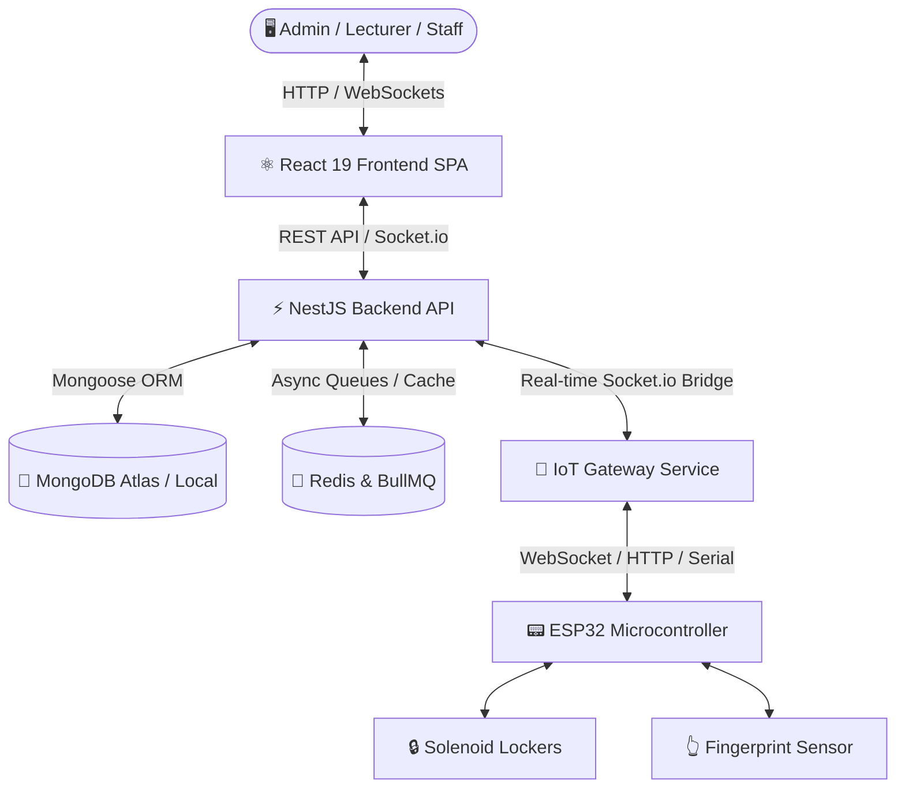

# 🏫 Smart Classroom & IoT Locker Management System
> **Hệ thống Quản lý Tủ đồ Thông minh & Phòng học Tích hợp IoT**

[](file:///c:/Users/admin/Desktop/DoAnTotNghiep/frontend)
[](file:///c:/Users/admin/Desktop/DoAnTotNghiep/backendAPI)
[](file:///c:/Users/admin/Desktop/DoAnTotNghiep/iot-gateway)
[](file:///c:/Users/admin/Desktop/DoAnTotNghiep/backendAPI)

---

## 📌 1. Giới thiệu Tổng quan (Project Overview)

**Smart Classroom & IoT Locker Management System** là giải pháp phần mềm toàn diện kết hợp giữa **Web Application hiện đại** và **Hệ thống phần cứng IoT (ESP32)** nhằm tự động hóa quy trình quản lý phòng học, bàn giao chìa khóa/tủ đồ thông minh, lịch mượn phòng và giám sát an ninh thời gian thực cho các trường học, trung tâm đào tạo hoặc doanh nghiệp lớn.

Dự án được xây dựng theo kiến trúc **Decoupled Architecture (Microservices-ready)**, đảm bảo tính mở rộng cao (Scalability), độ tin cậy thời gian thực (Real-time Reliability) và tuân thủ các chuẩn bảo mật doanh nghiệp (Enterprise Security Standards).

---

## 🏗️ 2. Kiến trúc Hệ thống (System Architecture)

Hệ thống được chia thành 3 phân hệ độc lập giao tiếp qua RESTful APIs và WebSockets thời gian thực:



### Chi tiết các phân hệ:
1. **Frontend (`/frontend`)**: Giao diện Single Page Application (SPA) xây dựng trên React 19, TypeScript, TailwindCSS và Radix UI components. Cung cấp Dashboard thời gian thực, quản lý lịch học, bàn giao tủ đồ và nhật ký hệ thống.
2. **Backend API (`/backendAPI`)**: Core server phát triển bằng NestJS (TypeScript), sử dụng MongoDB làm cơ sở dữ liệu chính và Redis/BullMQ cho hàng chờ xử lý tác vụ ngầm (gửi email thông báo, đồng bộ dữ liệu).
3. **IoT Gateway (`/iot-gateway`)**: Middleware làm cầu nối giữa hệ thống phần cứng ESP32 và Backend API, hỗ trợ các giao thức WebSocket, HTTP Ingest và Serial Port, tự động quản lý kết nối và đẩy lệnh đóng/mở khóa tức thì.

---

## 🔥 3. Các Tính năng Nổi bật (Key Features)

### 🔒 1. Quản lý Tủ đồ & Đóng/Mở Thông minh (Smart Locker & Hardware Control)
- **Đóng/Mở từ xa theo thời gian thực**: Thực hiện thao tác mở tủ đồ chứa chìa khóa phòng học ngay trên giao diện Web qua WebSockets.
- **Xác thực Sinh trắc học (Fingerprint Biometrics)**: Đăng ký và quét vân tay trực tiếp tại thiết bị IoT để mở tủ, tự động gửi dữ liệu xác thực về hệ thống.
- **Tự động phục hồi kết nối (Heartbeat & Auto-discovery)**: IoT Gateway liên tục giám sát trạng thái thiết bị ESP32, tự động cảnh báo khi mất kết nối hoặc thiết bị gặp sự cố.

### 📅 2. Quản lý Lịch học & Đặt phòng (Schedule & Booking Management)
- **Quản lý thời khóa biểu trực quan**: Hỗ trợ giảng viên theo dõi lịch dạy theo ca/ngày/tuần.
- **Chuyển giao ca dạy & Chìa khóa (Handover Requests)**: Giảng viên có thể gửi yêu cầu bàn giao ca dạy hoặc quyền sử dụng tủ đồ cho giảng viên khác với quy trình phê duyệt tự động.
- **Đặt phòng đột xuất & Phê duyệt (Booking System)**: Đặt phòng học trực tuyến với luồng duyệt nhanh chóng từ Admin/Quản trị viên.

### 👥 3. Phân quyền & Quản lý Người dùng (RBAC & User Management)
- **Phân quyền đa vai trò (Role-Based Access Control)**: Admin, Lecturer (Giảng viên), Support Staff (Kỹ thuật/Bảo vệ).
- **Đăng nhập linh hoạt**: Hỗ trợ đăng nhập qua tài khoản nội bộ (JWT Authentication) và Đăng nhập nhanh qua **Google OAuth2**.

### 📊 4. Giám sát An ninh & Nhật ký Hệ thống (Audit & Access Logging)
- **Nhật ký Truy cập (Access Logs)**: Ghi lại chính xác thời gian, người thực hiện và trạng thái (Thành công / Thất bại) mỗi khi tủ đồ được mở (qua Web hoặc Vân tay).
- **Nhật ký Hệ thống (Audit Logs)**: Lưu trữ mọi thao tác thay đổi cấu hình, tạo mới/xóa dữ liệu để phục vụ truy vết an ninh.
- **Báo cáo Thống kê (Analytics Dashboard)**: Biểu đồ trực quan (Recharts) thống kê tần suất sử dụng phòng học, tỷ lệ hoạt động của tủ đồ và danh sách sự cố cần xử lý.

---

## 🛠️ 4. Công nghệ Sử dụng (Tech Stack)

| Phân hệ | Công nghệ chính | Mô tả |
| :--- | :--- | :--- |
| **Frontend** | React 19, TypeScript, TailwindCSS, Radix UI, Recharts | Giao diện hiện đại, responsive, tối ưu trải nghiệm người dùng |
| **Backend API** | NestJS, TypeScript, Mongoose (MongoDB), Redis, BullMQ | RESTful API, WebSocket Server, Architecture chuẩn Clean Code |
| **IoT & Hardware** | Node.js, Socket.io, SerialPort, ESP32 (C/C++), Sensor Vân tay | Gateway giao tiếp phần cứng độ trễ thấp, tin cậy |
| **Authentication** | Passport.js, JWT, Google OAuth2, Bcrypt | Bảo mật đa tầng, phân quyền chặt chẽ |
| **DevOps & Deploy** | Railway, Vercel, Docker Ready, Mongo Atlas | Quy trình CI/CD và triển khai cloud dễ dàng |

---

## 🎯 5. Giá trị Kỹ thuật & Chuẩn Doanh nghiệp (Enterprise Value)

- **Clean Architecture & Design Patterns**: Áp dụng triệt để Dependency Injection, Repository Pattern, DTO Validation (class-validator) và Modular Design trong NestJS.
- **Real-time Bidirectional Communication**: Sử dụng Socket.io namespaces tối ưu luồng truyền tin dữ liệu hai chiều giữa Trình duyệt - Backend - Thiết bị IoT.
- **Reliability & Async Processing**: Tích hợp Redis Queue (BullMQ) xử lý các tác vụ nặng ngầm (gửi email thông báo, lưu log số lượng lớn) mà không làm tắc nghẽn main thread.
- **Security & Traceability**: Mã hóa mật khẩu với Bcrypt, bảo vệ API với JWT Guards, cơ chế Token Auth cho IoT Devices và Audit Logs toàn diện.

---

## 📁 6. Cấu trúc Thư mục Dự án (Project Structure)

```text
DoAnTotNghiep/
├── backendAPI/              # Source code Backend Service (NestJS)
│   ├── src/
│   │   ├── modules/         # Các Module nghiệp vụ (Users, Locker, Booking, Auth, AccessLogs...)
│   │   ├── database/        # Cấu hình MongoDB & Schemas
│   │   └── main.ts          # Entry point Backend API
├── frontend/                # Source code Frontend Client (React 19)
│   ├── src/
│   │   ├── pages/           # Giao diện Admin, Lecturer, Public pages
│   │   ├── components/      # UI Components (Radix UI / Custom)
│   │   └── services/        # API Client & Socket Connection
├── iot-gateway/             # Middleware Gateway giao tiếp ESP32
│   ├── src/
│   │   ├── services/        # Xử lý sự kiện vân tay & trạng thái tủ
│   │   └── app.js           # Server WebSocket & Serial Ingest
├── RAILWAY_DEPLOYMENT.md    # Hướng dẫn Deploy Backend & Gateway lên Railway
└── VERCEL_DEPLOYMENT.md     # Hướng dẫn Deploy Frontend lên Vercel
```

---

## 🚀 7. Cài đặt & Chạy Cục bộ (Local Setup)

### Yêu cầu tiên quyết
- Node.js (v18 trở lên)
- MongoDB Server (hoặc MongoDB Atlas URL)
- Redis Server (chạy cục bộ hoặc qua Cloud)

### Các bước khởi chạy:

1. **Khởi chạy Backend API**:
   ```bash
   cd backendAPI
   npm install
   # Tạo file .env dựa trên cấu hình mẫu
   npm run start:dev
   ```

2. **Khởi chạy Frontend**:
   ```bash
   cd frontend
   npm install
   npm start
   ```

3. **Khởi chạy IoT Gateway**:
   ```bash
   cd iot-gateway
   npm install
   npm start
   ```

---

## 🌐 8. Triển khai Production (Deployment Guide)

Chi tiết quy trình triển khai ứng dụng lên các nền tảng Cloud:
- 📖 [Hướng dẫn Deploy Backend API & IoT Gateway lên Railway](file:///c:/Users/admin/Desktop/DoAnTotNghiep/RAILWAY_DEPLOYMENT.md)
- 📖 [Hướng dẫn Deploy Frontend lên Vercel](file:///c:/Users/admin/Desktop/DoAnTotNghiep/VERCEL_DEPLOYMENT.md)

---

## 👤 Tác Giả & Liên Hệ (Author & Contact)

- **Họ và tên**: Cao Huỳnh Ngọc Như
- **Vị trí mong muốn**: Full-stack Developer / Backend / Frontend Developer (NestJS / React.js / IoT Node.js)
- **GitHub**: [github.com/NgocNhu1824](https://github.com/NgocNhu1824)
- **Project Repository**: [DoAnTotNghiep](https://github.com/NgocNhu1824/DoAnTotNghiep)

---
*Cảm ơn Quý doanh nghiệp / Nhà tuyển dụng đã dành thời gian xem qua dự án!* 🚀
