## 1. System Design

## 1.1. System Architecture

The SmartHub Room IoT system in the current project is built with a clear layered structure, including the presentation layer, business layer, data layer, and device integration layer. This structure helps the system run stably, scale more easily, and remain maintainable as the number of users and devices increases.

The goal of this architecture is to ensure centralized data processing at the backend, fast room status updates in real time, and smooth connection between field operations (unlocking, fingerprint verification, incident reporting) and the management workflow on web and mobile applications.

### 1.1.1. Architecture Overview

The overall architecture consists of five main component groups:

- User interface group, including web and mobile applications.
- Central business processing group at the Backend API.
- Data storage group with MongoDB and optional Redis caching.
- IoT integration group through the iot-gateway and ESP32 devices.
- External service group, including Google login, email, incident image storage, and Face ID processing.

In this model, the backend acts as the central orchestrator. All requests from web and mobile applications pass through the backend so that business rules, permissions, and system logs are applied consistently. Device-related operations are sent from the backend through the real-time channel to the iot-gateway, then forwarded to ESP32 devices and returned with response results.

### 1.1.2. Internal Sub-systems

#### 1.1.2.1. Identity and Access Management Sub-system

This sub-system includes the Auth, Users, Roles, and Campus modules. Its main responsibility is user authentication, role-based authorization, and scope control at different levels (individual, campus, and global). The system supports both Google login and password login, and uses tokens to authenticate subsequent requests.

#### 1.1.2.2. Academic and Classroom Data Sub-system

This sub-system includes the Schedule, Time Slots, and Room modules. The system receives schedule data through file import, then standardizes it into internal data used for room booking flows, borrowing/returning operations, and time-based room usage checks.

#### 1.1.2.3. Room Operation Sub-system

This sub-system includes Booking, Transfers, Locker, and Device modules. It directly handles daily operation workflows, including creating and approving room requests, transferring teaching rooms, remotely unlocking lockers, and synchronizing classroom information with smart lock devices.

#### 1.1.2.4. Monitoring and Operational Safety Sub-system

This sub-system includes Access Logs, Audit Logs, Incidents, and Notifications modules. Its role is to record room access history, monitor system activity, receive and process incidents, and send notifications to the correct users. This is the core foundation for event traceability and operational control.

#### 1.1.2.5. System Configuration Sub-system

The Settings module manages global and campus-level operating parameters. Caching is used to reduce query load while preserving consistency when settings are updated.

### 1.1.3. IoT Integration Sub-system

In this project, IoT integration is organized in a three-layer processing chain:

- Backend real-time layer: publishes and receives events through the Socket.IO /events channel.
- iot-gateway layer: receives commands from the backend, forwards them to devices, receives device status, and synchronizes data back to the backend.
- ESP32 device layer: controls relay locks, reads sensors/fingerprint input, and sends authentication and operational status results.

In the fingerprint flow, the backend creates registration or verification commands with a matching key (correlationId). ESP32 sends results to the gateway, the gateway forwards results to the backend, and the backend updates logs and emits real-time events so that mobile screens are updated immediately. This design keeps the fingerprint registration flow synchronized and traceable.

### 1.1.4. External Systems and Integration Services

The current system integrates with the following external services:

- Google login service: supports user login by institutional account.
- SMTP email service: supports forgot-password and password reset flows.
- Google Drive storage service: stores incident images submitted by users.
- Face ID processing service: generates and matches face vectors.
- FAP/Excel schedule source: imported into the system through file-based import flow.

This integration approach allows the system to leverage external platforms while keeping the backend as the central control point to ensure data consistency.

### 1.1.5. Communication and Data Synchronization Flow

The overall communication flow is as follows:

1. Users perform actions on the web or mobile application.
2. Requests are sent to the backend for authentication, permission checks, and business processing.
3. The backend reads and writes data in MongoDB and uses cache when needed.
4. If a workflow is device-related, the backend sends commands to the iot-gateway.
5. The iot-gateway forwards commands to ESP32 and receives device responses.
6. Device status is synchronized back to the backend through IoT APIs.
7. The backend updates logs, updates business state, and emits real-time events so the UI can refresh immediately.

This mechanism ensures continuous synchronization between web, mobile, and physical devices, reducing delayed information during real-world operations.

### 1.1.6. Architecture Assessment for the Thesis

The current architecture is suitable for the thesis objectives for the following reasons:

1. Scalability: each functional area is modularized, making it easier to extend new features.
2. Stability: the gateway acts as an intermediate layer and supports command queueing when device connectivity is unstable.
3. Security: the system applies role-based authorization and keeps complete logs for traceability.
4. Real-time capability: critical data is published through real-time channels, which fits IoT use cases in educational environments.

### 1.1.7. UML for Overall Architecture Diagram

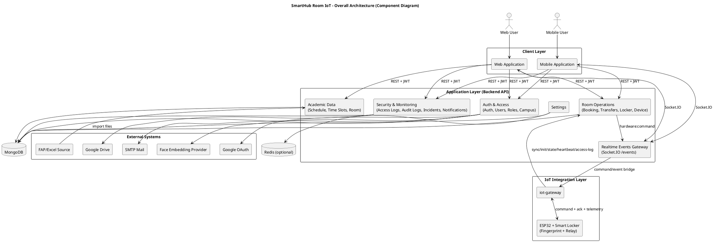

### 1.1.8. Explanation of Diagram Components

1. Web Application
- Main interface for administrators and operational staff.
- Sends business requests to backend APIs and receives realtime updates.

2. Mobile Application
- Main interface for field operations (schedule checking, room unlock, incident report).
- Uses API and realtime events to keep user state up to date.

3. Auth & Access
- Handles authentication, authorization, and scope control.
- Integrates with Google OAuth, SMTP, and Face Embedding Provider.

4. Academic Data
- Manages schedule, time slots, and classroom data.
- Receives schedule source data through import flow.

5. Room Operations
- Handles booking, transfer, locker, and device-related business logic.
- Sends hardware commands to realtime gateway and receives IoT synchronization data.

6. Security & Monitoring
- Handles incidents, access logs, audit logs, and notifications.
- Stores incident images in Google Drive when needed.

7. Settings
- Stores system and campus-level configuration.
- Uses Redis cache to reduce repeated reads where applicable.

8. Realtime Events Gateway
- Publishes and receives realtime events via Socket.IO.
- Connects application layer with both clients and IoT bridge.

9. MongoDB
- Main persistent storage for all core business data.

10. Redis (optional)
- Cache layer for configuration and high-frequency reads.

11. iot-gateway
- Translates backend events into device commands.
- Collects telemetry from devices and synchronizes back to backend.

12. ESP32 + Smart Locker
- Physical device layer for lock control and fingerprint interactions.

13. External Systems
- Google OAuth: user login integration.
- SMTP Mail: forgot/reset password emails.
- Google Drive: incident image storage.
- Face Embedding Provider: face vector generation and matching.
- FAP/Excel Source: schedule import source.

# 3. Use Case Design

This document has been standardized with a total of 12 use cases:
1) UC-01 Login
2) UC-02 Logout
3) UC-07 Register Face ID
4) UC-14 Import Users Bulk
5) UC-26 Import Rooms Bulk
6) UC-41 View System Logs
7) UC-57 View Notifications
8) UC-58 Report Incident
9) UC-59 Handle Incidents
10) UC-60 View Access Logs
11) UC-62 Unlock Room via IoT
12) UC-63 Send Notification

## 3.1.1. UC-01 Login

### 3.1.1.1. Class Diagram

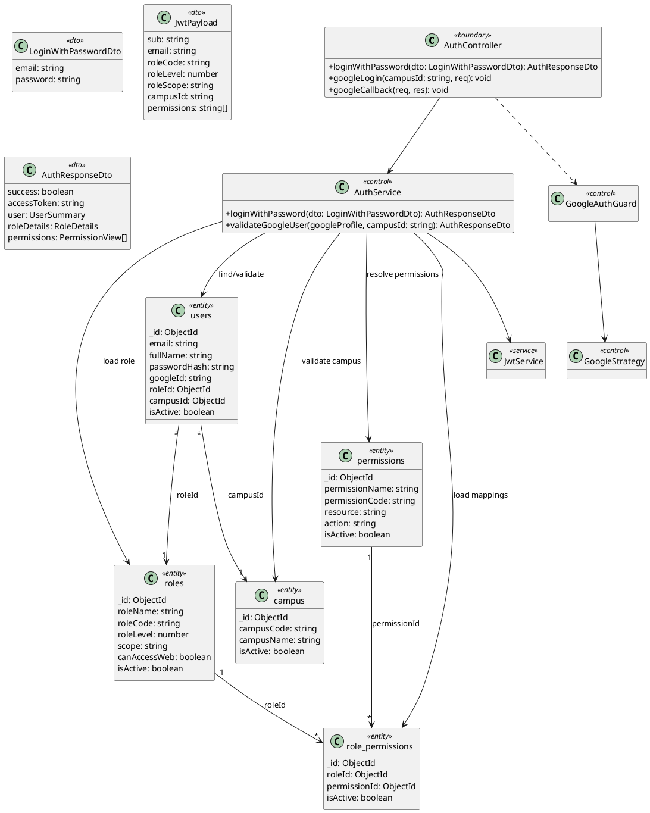

### 3.1.1.2. Class Specification

<table style="width:100%; border-collapse:collapse;" border="1" cellspacing="0" cellpadding="6">
  <tr>
    <td><strong>UC ID and Name</strong></td>
    <td colspan="3">UC-01 Login</td>
  </tr>
  <tr>
    <td><strong>Created By</strong></td>
    <td>Team Backend</td>
    <td><strong>Date Created</strong></td>
    <td>04/04/2026</td>
  </tr>
  <tr>
    <td><strong>Primary Actor</strong></td>
    <td>User</td>
    <td><strong>Secondary Actors</strong></td>
    <td>Google Account (for Google login)</td>
  </tr>
  <tr>
    <td><strong>Trigger</strong></td>
    <td colspan="3">User submits login request.</td>
  </tr>
  <tr>
    <td><strong>Description</strong></td>
    <td colspan="3">The system validates credentials and grants access based on role/permission scope.</td>
  </tr>
  <tr>
    <td><strong>Preconditions</strong></td>
    <td colspan="3">User account exists and is active.</td>
  </tr>
  <tr>
    <td><strong>Postconditions</strong></td>
    <td colspan="3">User is authenticated and receives access token/profile scope.</td>
  </tr>
  <tr>
    <td><strong>Normal Flow</strong></td>
    <td colspan="3">1) User opens login page. 2) User selects login method. 3) User submits credentials. 4) System validates account and permission scope. 5) System returns token and profile. 6) User is redirected to workspace.</td>
  </tr>
  <tr>
    <td><strong>Alternative Flows</strong></td>
    <td colspan="3">A1: User logs in with Google OAuth instead of email/password.</td>
  </tr>
  <tr>
    <td><strong>Exceptions</strong></td>
    <td colspan="3">E1: Invalid credentials. E2: Inactive account. E3: Account not found.</td>
  </tr>
  <tr>
    <td><strong>Priority</strong></td>
    <td colspan="3">High</td>
  </tr>
  <tr>
    <td><strong>Frequency of Use</strong></td>
    <td colspan="3">Very High</td>
  </tr>
  <tr>
    <td><strong>Business Rules</strong></td>
    <td colspan="3"></td>
  </tr>
  <tr>
    <td><strong>Other Information</strong></td>
    <td colspan="3">Access token should be stored securely on client side.</td>
  </tr>
  <tr>
    <td><strong>Assumptions</strong></td>
    <td colspan="3">Stable network and valid campus context are available.</td>
  </tr>
</table>

### 3.1.1.3. Sequence Diagram

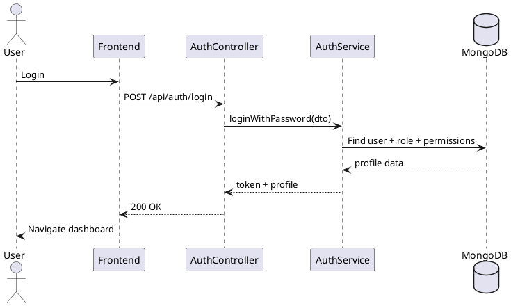

## 3.1.2. UC-02 Logout

### 3.1.2.1. Class Diagram

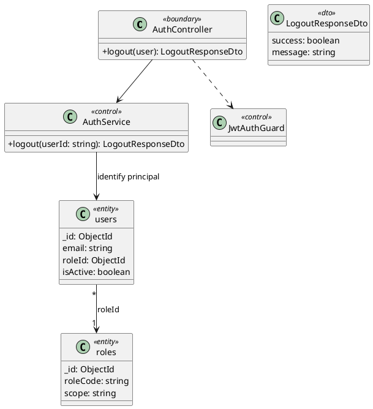

### 3.1.2.2. Class Specification

<table style="width:100%; border-collapse:collapse;" border="1" cellspacing="0" cellpadding="6">
  <tr>
    <td><strong>UC ID and Name</strong></td>
    <td colspan="3">UC-02 Logout</td>
  </tr>
  <tr>
    <td><strong>Created By</strong></td>
    <td>Team Backend</td>
    <td><strong>Date Created</strong></td>
    <td>04/04/2026</td>
  </tr>
  <tr>
    <td><strong>Primary Actor</strong></td>
    <td>Authenticated User</td>
    <td><strong>Secondary Actors</strong></td>
    <td>None</td>
  </tr>
  <tr>
    <td><strong>Trigger</strong></td>
    <td colspan="3">User clicks logout button.</td>
  </tr>
  <tr>
    <td><strong>Description</strong></td>
    <td colspan="3">The system ends current session and redirects user to login screen.</td>
  </tr>
  <tr>
    <td><strong>Preconditions</strong></td>
    <td colspan="3">User is currently authenticated.</td>
  </tr>
  <tr>
    <td><strong>Postconditions</strong></td>
    <td colspan="3">User session is cleared and user must login again for protected actions.</td>
  </tr>
  <tr>
    <td><strong>Normal Flow</strong></td>
    <td colspan="3">1) User clicks logout. 2) System validates active session/token. 3) System clears auth state. 4) System redirects to login screen.</td>
  </tr>
  <tr>
    <td><strong>Alternative Flows</strong></td>
    <td colspan="3">A1: User closes app/browser without pressing logout; token expires by session policy.</td>
  </tr>
  <tr>
    <td><strong>Exceptions</strong></td>
    <td colspan="3">E1: Session already expired before logout request.</td>
  </tr>
  <tr>
    <td><strong>Priority</strong></td>
    <td colspan="3">High</td>
  </tr>
  <tr>
    <td><strong>Frequency of Use</strong></td>
    <td colspan="3">High</td>
  </tr>
  <tr>
    <td><strong>Business Rules</strong></td>
    <td colspan="3"></td>
  </tr>
  <tr>
    <td><strong>Other Information</strong></td>
    <td colspan="3">A clear logout-success message should be shown to user.</td>
  </tr>
  <tr>
    <td><strong>Assumptions</strong></td>
    <td colspan="3">User logs out via official application interface.</td>
  </tr>
</table>

### 3.1.2.3. Sequence Diagram

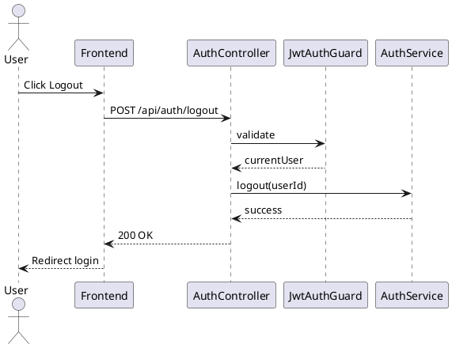

## 3.1.7. UC-07 Register Face ID

### 3.1.7.1. Class Diagram

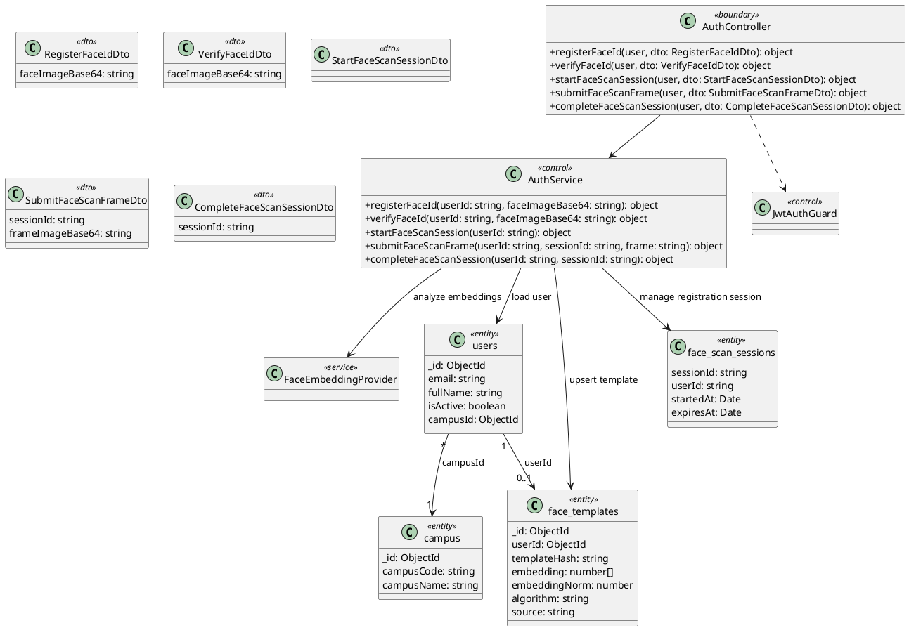

### 3.1.7.2. Class Specification

<table style="width:100%; border-collapse:collapse;" border="1" cellspacing="0" cellpadding="6">
  <tr>
    <td><strong>UC ID and Name</strong></td>
    <td colspan="3">UC-07 Register Face ID</td>
  </tr>
  <tr>
    <td><strong>Created By</strong></td>
    <td>Team Backend</td>
    <td><strong>Date Created</strong></td>
    <td>04/04/2026</td>
  </tr>
  <tr>
    <td><strong>Primary Actor</strong></td>
    <td>Authenticated User</td>
    <td><strong>Secondary Actors</strong></td>
    <td>Face Provider / Biometric SDK</td>
  </tr>
  <tr>
    <td><strong>Trigger</strong></td>
    <td colspan="3">User starts Face ID registration process.</td>
  </tr>
  <tr>
    <td><strong>Description</strong></td>
    <td colspan="3">The system captures face data and stores a valid biometric template.</td>
  </tr>
  <tr>
    <td><strong>Preconditions</strong></td>
    <td colspan="3">User is logged in and device camera is available.</td>
  </tr>
  <tr>
    <td><strong>Postconditions</strong></td>
    <td colspan="3">User has one active face template linked to account.</td>
  </tr>
  <tr>
    <td><strong>Normal Flow</strong></td>
    <td colspan="3">1) User opens register face screen. 2) App captures required face scans. 3) System validates image quality. 4) Provider returns embedding. 5) System upserts face template. 6) System confirms registration success.</td>
  </tr>
  <tr>
    <td><strong>Alternative Flows</strong></td>
    <td colspan="3">A1: User retries scan when quality check fails.</td>
  </tr>
  <tr>
    <td><strong>Exceptions</strong></td>
    <td colspan="3">E1: No face detected. E2: Low image quality. E3: Provider timeout/error.</td>
  </tr>
  <tr>
    <td><strong>Priority</strong></td>
    <td colspan="3">High</td>
  </tr>
  <tr>
    <td><strong>Frequency of Use</strong></td>
    <td colspan="3">Medium</td>
  </tr>
  <tr>
    <td><strong>Business Rules</strong></td>
    <td colspan="3"></td>
  </tr>
  <tr>
    <td><strong>Other Information</strong></td>
    <td colspan="3">Re-registration overwrites the previous active template.</td>
  </tr>
  <tr>
    <td><strong>Assumptions</strong></td>
    <td colspan="3">Device permissions for camera are granted.</td>
  </tr>
</table>

### 3.1.7.3. Sequence Diagram

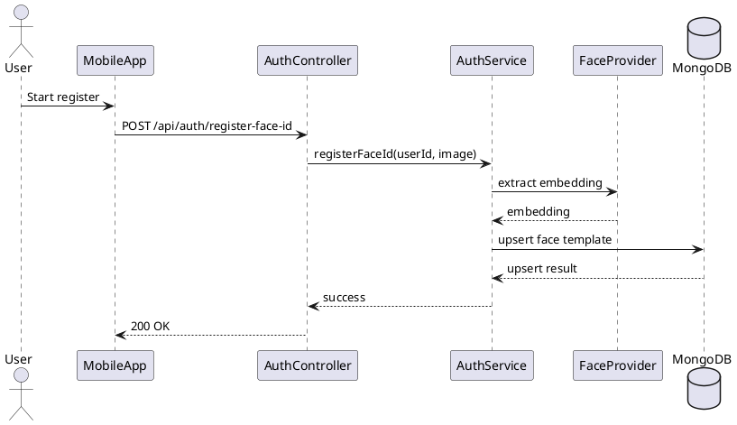

## 3.1.14. UC-14 Import Users Bulk

### 3.1.14.1. Class Diagram

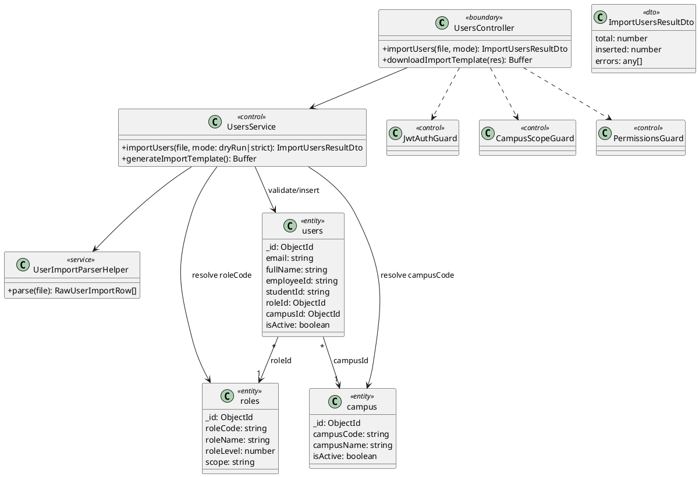

### 3.1.14.2. Class Specification

<table style="width:100%; border-collapse:collapse;" border="1" cellspacing="0" cellpadding="6">
  <tr>
    <td><strong>UC ID and Name</strong></td>
    <td colspan="3">UC-14 Import Users Bulk</td>
  </tr>
  <tr>
    <td><strong>Created By</strong></td>
    <td>Team Backend</td>
    <td><strong>Date Created</strong></td>
    <td>04/04/2026</td>
  </tr>
  <tr>
    <td><strong>Primary Actor</strong></td>
    <td>Admin / Training Officer</td>
    <td><strong>Secondary Actors</strong></td>
    <td>None</td>
  </tr>
  <tr>
    <td><strong>Trigger</strong></td>
    <td colspan="3">Actor uploads bulk users file.</td>
  </tr>
  <tr>
    <td><strong>Description</strong></td>
    <td colspan="3">The system validates template rows and creates user records in bulk.</td>
  </tr>
  <tr>
    <td><strong>Preconditions</strong></td>
    <td colspan="3">Actor has users.create permission and valid template file format.</td>
  </tr>
  <tr>
    <td><strong>Postconditions</strong></td>
    <td colspan="3">Valid user rows are imported and summary report is returned.</td>
  </tr>
  <tr>
    <td><strong>Normal Flow</strong></td>
    <td colspan="3">1) Actor uploads file. 2) System parses rows. 3) System validates role/campus and unique email. 4) System inserts valid users. 5) System returns import summary.</td>
  </tr>
  <tr>
    <td><strong>Alternative Flows</strong></td>
    <td colspan="3">A1: Actor selects update mode for existing records when supported.</td>
  </tr>
  <tr>
    <td><strong>Exceptions</strong></td>
    <td colspan="3">E1: Duplicate email. E2: Invalid role/campus reference. E3: Invalid file structure.</td>
  </tr>
  <tr>
    <td><strong>Priority</strong></td>
    <td colspan="3">High</td>
  </tr>
  <tr>
    <td><strong>Frequency of Use</strong></td>
    <td colspan="3">Medium</td>
  </tr>
  <tr>
    <td><strong>Business Rules</strong></td>
    <td colspan="3"></td>
  </tr>
  <tr>
    <td><strong>Other Information</strong></td>
    <td colspan="3">Summary should include success, failed rows, and reasons.</td>
  </tr>
  <tr>
    <td><strong>Assumptions</strong></td>
    <td colspan="3">Import template columns follow system standard.</td>
  </tr>
</table>

### 3.1.14.3. Sequence Diagram

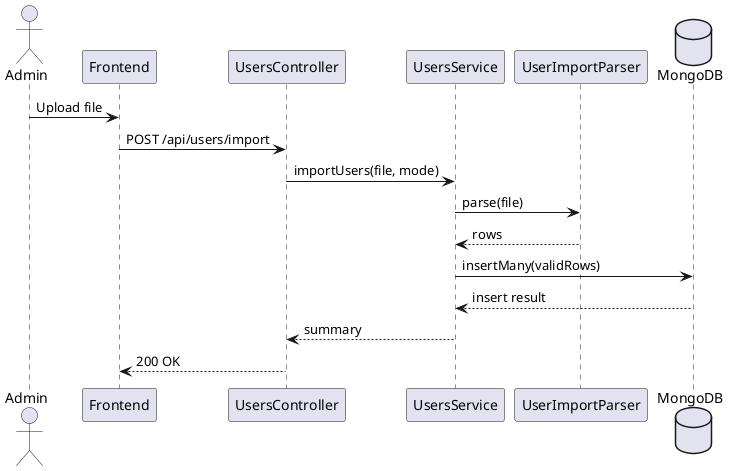

## 3.1.26. UC-26 Import Rooms Bulk

### 3.1.26.1. Class Diagram

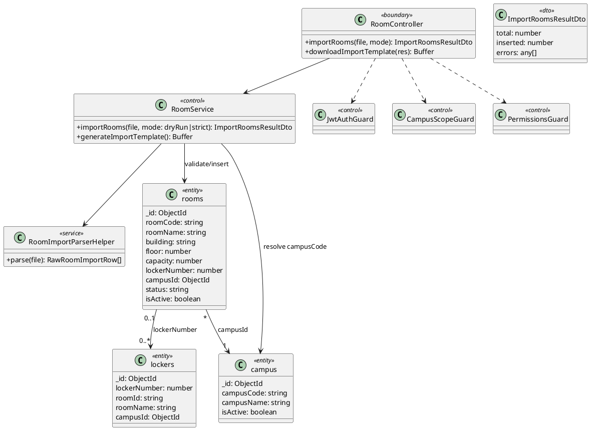

### 3.1.26.2. Class Specification

<table style="width:100%; border-collapse:collapse;" border="1" cellspacing="0" cellpadding="6">
  <tr>
    <td><strong>UC ID and Name</strong></td>
    <td colspan="3">UC-26 Import Rooms Bulk</td>
  </tr>
  <tr>
    <td><strong>Created By</strong></td>
    <td>Team Backend</td>
    <td><strong>Date Created</strong></td>
    <td>04/04/2026</td>
  </tr>
  <tr>
    <td><strong>Primary Actor</strong></td>
    <td>Admin / Training Officer</td>
    <td><strong>Secondary Actors</strong></td>
    <td>None</td>
  </tr>
  <tr>
    <td><strong>Trigger</strong></td>
    <td colspan="3">Actor uploads bulk rooms file.</td>
  </tr>
  <tr>
    <td><strong>Description</strong></td>
    <td colspan="3">The system validates room data and creates rooms in bulk.</td>
  </tr>
  <tr>
    <td><strong>Preconditions</strong></td>
    <td colspan="3">Actor has rooms.create permission and valid room template file.</td>
  </tr>
  <tr>
    <td><strong>Postconditions</strong></td>
    <td colspan="3">Valid rooms are imported and import summary is generated.</td>
  </tr>
  <tr>
    <td><strong>Normal Flow</strong></td>
    <td colspan="3">1) Actor uploads file. 2) System parses room rows. 3) System validates roomCode uniqueness and campus mapping. 4) System inserts valid rooms. 5) System returns summary.</td>
  </tr>
  <tr>
    <td><strong>Alternative Flows</strong></td>
    <td colspan="3">A1: Import mode can skip duplicate rows and continue processing.</td>
  </tr>
  <tr>
    <td><strong>Exceptions</strong></td>
    <td colspan="3">E1: Duplicate roomCode. E2: Invalid campus value. E3: Missing required columns.</td>
  </tr>
  <tr>
    <td><strong>Priority</strong></td>
    <td colspan="3">High</td>
  </tr>
  <tr>
    <td><strong>Frequency of Use</strong></td>
    <td colspan="3">Medium</td>
  </tr>
  <tr>
    <td><strong>Business Rules</strong></td>
    <td colspan="3"></td>
  </tr>
  <tr>
    <td><strong>Other Information</strong></td>
    <td colspan="3">Room import may be followed by locker synchronization.</td>
  </tr>
  <tr>
    <td><strong>Assumptions</strong></td>
    <td colspan="3">Uploaded file follows standard room import template.</td>
  </tr>
</table>

### 3.1.26.3. Sequence Diagram

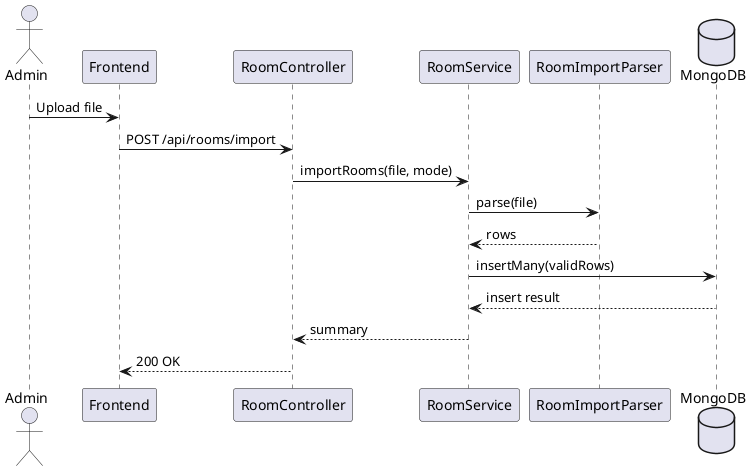

## 3.1.41. UC-41 View System Logs

### 3.1.41.1. Class Diagram

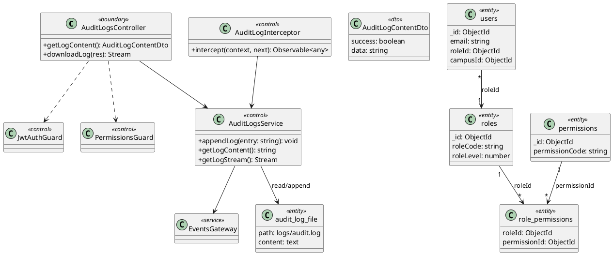

### 3.1.41.2. Class Specification

<table style="width:100%; border-collapse:collapse;" border="1" cellspacing="0" cellpadding="6">
  <tr>
    <td><strong>UC ID and Name</strong></td>
    <td colspan="3">UC-41 View System Logs</td>
  </tr>
  <tr>
    <td><strong>Created By</strong></td>
    <td>Team Backend</td>
    <td><strong>Date Created</strong></td>
    <td>04/04/2026</td>
  </tr>
  <tr>
    <td><strong>Primary Actor</strong></td>
    <td>System Admin / Campus Admin</td>
    <td><strong>Secondary Actors</strong></td>
    <td>Log Storage (audit.log)</td>
  </tr>
  <tr>
    <td><strong>Trigger</strong></td>
    <td colspan="3">Actor opens audit logs page.</td>
  </tr>
  <tr>
    <td><strong>Description</strong></td>
    <td colspan="3">The system verifies permission and returns audit log content for viewing/downloading.</td>
  </tr>
  <tr>
    <td><strong>Preconditions</strong></td>
    <td colspan="3">Actor is authenticated and has logs.read permission.</td>
  </tr>
  <tr>
    <td><strong>Postconditions</strong></td>
    <td colspan="3">Logs are displayed or downloaded for authorized actor.</td>
  </tr>
  <tr>
    <td><strong>Normal Flow</strong></td>
    <td colspan="3">1) Actor requests logs. 2) Guard checks permission. 3) Service reads audit log file. 4) Controller returns log content.</td>
  </tr>
  <tr>
    <td><strong>Alternative Flows</strong></td>
    <td colspan="3">A1: Actor requests logs with pagination/filter options (if supported).</td>
  </tr>
  <tr>
    <td><strong>Exceptions</strong></td>
    <td colspan="3">E1: Permission denied. E2: Log file not found/read error.</td>
  </tr>
  <tr>
    <td><strong>Priority</strong></td>
    <td colspan="3">Medium</td>
  </tr>
  <tr>
    <td><strong>Frequency of Use</strong></td>
    <td colspan="3">Medium</td>
  </tr>
  <tr>
    <td><strong>Business Rules</strong></td>
    <td colspan="3"></td>
  </tr>
  <tr>
    <td><strong>Other Information</strong></td>
    <td colspan="3">Access should remain read-only and auditable.</td>
  </tr>
  <tr>
    <td><strong>Assumptions</strong></td>
    <td colspan="3">Audit file path is configured and accessible by service runtime.</td>
  </tr>
</table>

### 3.1.41.3. Sequence Diagram

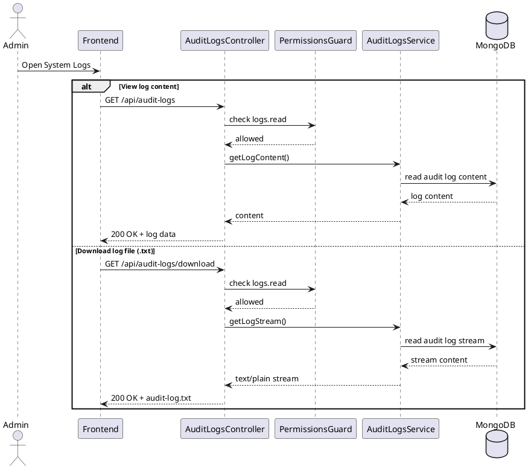

## 3.1.57. UC-57 View Notifications

### 3.1.57.1. Class Diagram

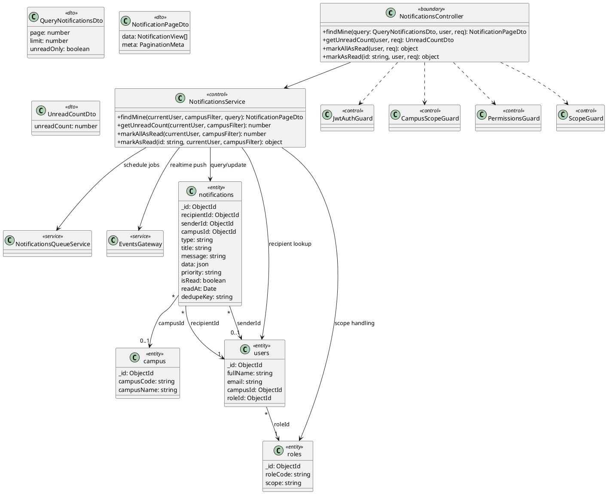

### 3.1.57.2. Class Specification

<table style="width:100%; border-collapse:collapse;" border="1" cellspacing="0" cellpadding="6">
  <tr>
    <td><strong>UC ID and Name</strong></td>
    <td colspan="3">UC-57 View Notifications</td>
  </tr>
  <tr>
    <td><strong>Created By</strong></td>
    <td>Team Backend</td>
    <td><strong>Date Created</strong></td>
    <td>04/04/2026</td>
  </tr>
  <tr>
    <td><strong>Primary Actor</strong></td>
    <td>Authenticated User</td>
    <td><strong>Secondary Actors</strong></td>
    <td>Notification Service</td>
  </tr>
  <tr>
    <td><strong>Trigger</strong></td>
    <td colspan="3">User opens notification center.</td>
  </tr>
  <tr>
    <td><strong>Description</strong></td>
    <td colspan="3">The system returns user notifications and supports read/unread tracking.</td>
  </tr>
  <tr>
    <td><strong>Preconditions</strong></td>
    <td colspan="3">User is authenticated with notifications.read permission.</td>
  </tr>
  <tr>
    <td><strong>Postconditions</strong></td>
    <td colspan="3">Notifications are displayed and read status can be updated.</td>
  </tr>
  <tr>
    <td><strong>Normal Flow</strong></td>
    <td colspan="3">1) User opens notifications. 2) Frontend requests API list. 3) Service queries notifications by recipient/scope. 4) System returns list. 5) User marks notification as read.</td>
  </tr>
  <tr>
    <td><strong>Alternative Flows</strong></td>
    <td colspan="3">A1: System returns empty list when no notifications exist.</td>
  </tr>
  <tr>
    <td><strong>Exceptions</strong></td>
    <td colspan="3">E1: Unauthorized. E2: Forbidden by scope/permission.</td>
  </tr>
  <tr>
    <td><strong>Priority</strong></td>
    <td colspan="3">High</td>
  </tr>
  <tr>
    <td><strong>Frequency of Use</strong></td>
    <td colspan="3">High</td>
  </tr>
  <tr>
    <td><strong>Business Rules</strong></td>
    <td colspan="3"></td>
  </tr>
  <tr>
    <td><strong>Other Information</strong></td>
    <td colspan="3">Unread count should be updated after mark-read action.</td>
  </tr>
  <tr>
    <td><strong>Assumptions</strong></td>
    <td colspan="3">Notification dedupe and priority policy are already configured.</td>
  </tr>
</table>

### 3.1.57.3. Sequence Diagram

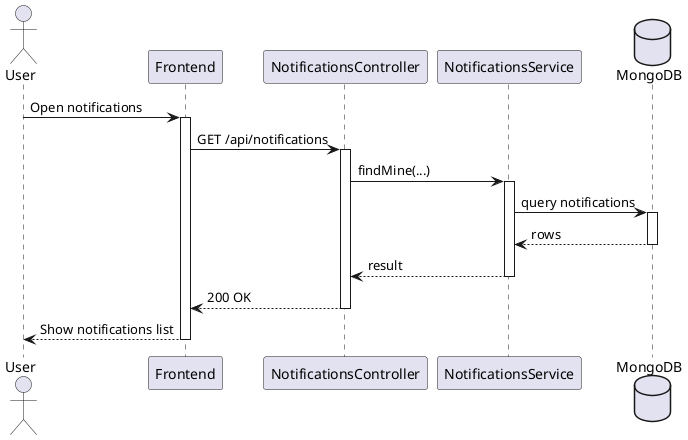

## 3.1.58. UC-58 Report Incident

### 3.1.58.1. Class Diagram

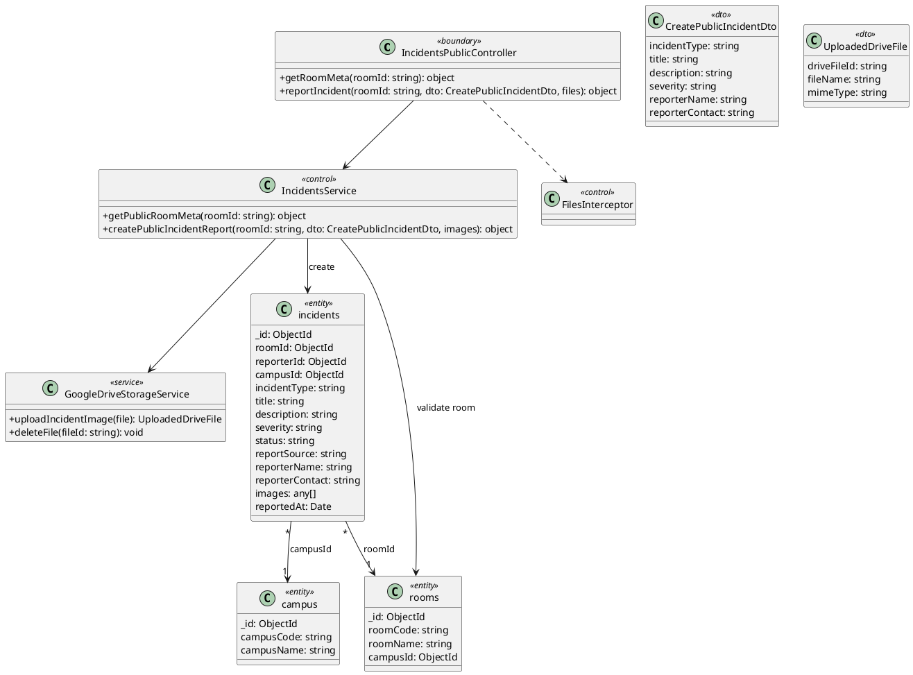

### 3.1.58.2. Class Specification

<table style="width:100%; border-collapse:collapse;" border="1" cellspacing="0" cellpadding="6">
  <tr>
    <td><strong>UC ID and Name</strong></td>
    <td colspan="3">UC-58 Report Incident</td>
  </tr>
  <tr>
    <td><strong>Created By</strong></td>
    <td>Team Backend</td>
    <td><strong>Date Created</strong></td>
    <td>04/04/2026</td>
  </tr>
  <tr>
    <td><strong>Primary Actor</strong></td>
    <td>Public Reporter / Authenticated User</td>
    <td><strong>Secondary Actors</strong></td>
    <td>None</td>
  </tr>
  <tr>
    <td><strong>Trigger</strong></td>
    <td colspan="3">Reporter submits incident form.</td>
  </tr>
  <tr>
    <td><strong>Description</strong></td>
    <td colspan="3">The system validates incident payload and creates new incident record.</td>
  </tr>
  <tr>
    <td><strong>Preconditions</strong></td>
    <td colspan="3">Valid room link and required report fields are provided.</td>
  </tr>
  <tr>
    <td><strong>Postconditions</strong></td>
    <td colspan="3">Incident is stored with initial status and tracking info.</td>
  </tr>
  <tr>
    <td><strong>Normal Flow</strong></td>
    <td colspan="3">1) Reporter opens report form. 2) Reporter enters incident detail and attachments. 3) System validates payload. 4) System creates incident. 5) System returns success response.</td>
  </tr>
  <tr>
    <td><strong>Alternative Flows</strong></td>
    <td colspan="3">A1: Reporter submits without image attachments.</td>
  </tr>
  <tr>
    <td><strong>Exceptions</strong></td>
    <td colspan="3">E1: Invalid room id/link. E2: Invalid payload format. E3: Upload failure.</td>
  </tr>
  <tr>
    <td><strong>Priority</strong></td>
    <td colspan="3">High</td>
  </tr>
  <tr>
    <td><strong>Frequency of Use</strong></td>
    <td colspan="3">Medium</td>
  </tr>
  <tr>
    <td><strong>Business Rules</strong></td>
    <td colspan="3"></td>
  </tr>
  <tr>
    <td><strong>Other Information</strong></td>
    <td colspan="3">Incident source can be public link or authenticated portal.</td>
  </tr>
  <tr>
    <td><strong>Assumptions</strong></td>
    <td colspan="3">Reporter contact information is available when follow-up is required.</td>
  </tr>
</table>

### 3.1.58.3. Sequence Diagram

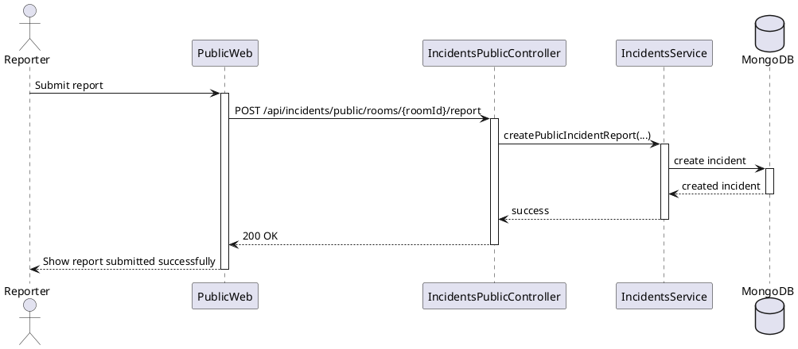

## 3.1.59. UC-59 Handle Incidents

### 3.1.59.1. Class Diagram

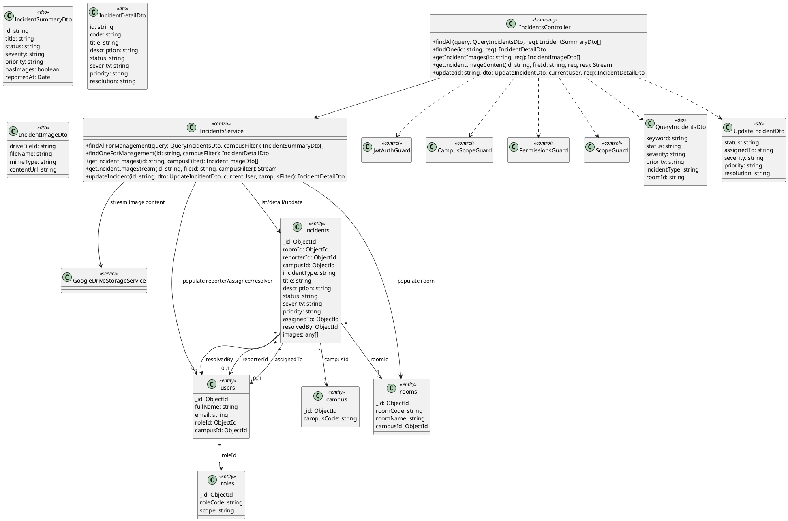

### 3.1.59.2. Class Specification

<table style="width:100%; border-collapse:collapse;" border="1" cellspacing="0" cellpadding="6">
  <tr>
    <td><strong>UC ID and Name</strong></td>
    <td colspan="3">UC-59 Handle Incidents</td>
  </tr>
  <tr>
    <td><strong>Created By</strong></td>
    <td>Team Backend</td>
    <td><strong>Date Created</strong></td>
    <td>04/04/2026</td>
  </tr>
  <tr>
    <td><strong>Primary Actor</strong></td>
    <td>Admin / Training Officer</td>
    <td><strong>Secondary Actors</strong></td>
    <td>None</td>
  </tr>
  <tr>
    <td><strong>Trigger</strong></td>
    <td colspan="3">Actor opens incidents management page.</td>
  </tr>
  <tr>
    <td><strong>Description</strong></td>
    <td colspan="3">The system provides incident overview list, incident detail, image viewing via Drive API, and status updates through field status.</td>
  </tr>
  <tr>
    <td><strong>Preconditions</strong></td>
    <td colspan="3">Actor has incidents.read permission and valid scope access; status update action requires incidents.update or incidents.resolve permission.</td>
  </tr>
  <tr>
    <td><strong>Postconditions</strong></td>
    <td colspan="3">Incident list/detail and images are displayed, and updated status is persisted.</td>
  </tr>
  <tr>
    <td><strong>Normal Flow</strong></td>
    <td colspan="3">1) Actor opens incidents management page. 2) Frontend requests incident list with filters. 3) Actor selects one incident to view detail. 4) Frontend loads image list and image content from Drive API endpoint when needed. 5) Actor updates incident status by field status (reported/in_progress/resolved/closed). 6) System returns updated incident detail and refreshes list badge.</td>
  </tr>
  <tr>
    <td><strong>Alternative Flows</strong></td>
    <td colspan="3">A1: Actor opens detail from notification deep-link. A2: Incident has no images, so image preview step is skipped.</td>
  </tr>
  <tr>
    <td><strong>Exceptions</strong></td>
    <td colspan="3">E1: Incident not found. E2: Forbidden by role/scope/permission. E3: Incident image not found or Drive content unavailable. E4: Invalid update payload/status value.</td>
  </tr>
  <tr>
    <td><strong>Priority</strong></td>
    <td colspan="3">High</td>
  </tr>
  <tr>
    <td><strong>Frequency of Use</strong></td>
    <td colspan="3">High</td>
  </tr>
  <tr>
    <td><strong>Business Rules</strong></td>
    <td colspan="3"></td>
  </tr>
  <tr>
    <td><strong>Other Information</strong></td>
    <td colspan="3">Status field reflects unresolved/resolved handling state and supports management workflow tracking.</td>
  </tr>
  <tr>
    <td><strong>Assumptions</strong></td>
    <td colspan="3">Incident id and driveFileId values are valid format when provided by UI.</td>
  </tr>
</table>

### 3.1.59.3. Sequence Diagram

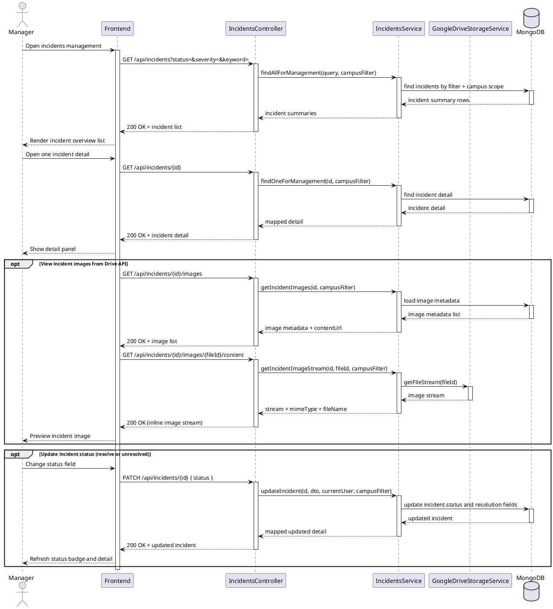

## UC-41 (Bo sung): View System Log

### Class Specification

<table style="width:100%; border-collapse:collapse;" border="1" cellspacing="0" cellpadding="6">
  <tr>
    <td><strong>UC ID and Name</strong></td>
    <td colspan="3">UC-41 View System Log</td>
  </tr>
  <tr>
    <td><strong>Created By</strong></td>
    <td>Team Backend</td>
    <td><strong>Date Created</strong></td>
    <td>05/04/2026</td>
  </tr>
  <tr>
    <td><strong>Primary Actor</strong></td>
    <td>System Admin / Campus Admin</td>
    <td><strong>Secondary Actors</strong></td>
    <td>Log Storage (audit.log)</td>
  </tr>
  <tr>
    <td><strong>Trigger</strong></td>
    <td colspan="3">Actor opens System Logs page.</td>
  </tr>
  <tr>
    <td><strong>Description</strong></td>
    <td colspan="3">The system validates permission and returns audit log content for view/download.</td>
  </tr>
  <tr>
    <td><strong>Preconditions</strong></td>
    <td colspan="3">Actor is authenticated and has logs.read permission.</td>
  </tr>
  <tr>
    <td><strong>Postconditions</strong></td>
    <td colspan="3">Log data is returned to UI for display or file download.</td>
  </tr>
  <tr>
    <td><strong>Normal Flow</strong></td>
    <td colspan="3">1) Actor opens logs page. 2) Frontend sends GET logs request. 3) Guard checks permission/scope. 4) Service reads audit log file. 5) Controller returns log content.</td>
  </tr>
  <tr>
    <td><strong>Alternative Flows</strong></td>
    <td colspan="3">A1: Actor requests download log stream instead of inline content.</td>
  </tr>
  <tr>
    <td><strong>Exceptions</strong></td>
    <td colspan="3">E1: Permission denied. E2: Log file not found. E3: Read stream error.</td>
  </tr>
  <tr>
    <td><strong>Priority</strong></td>
    <td colspan="3">Medium</td>
  </tr>
  <tr>
    <td><strong>Frequency of Use</strong></td>
    <td colspan="3">Medium</td>
  </tr>
  <tr>
    <td><strong>Business Rules</strong></td>
    <td colspan="3"></td>
  </tr>
  <tr>
    <td><strong>Other Information</strong></td>
    <td colspan="3">Access to system log is read-only and should remain auditable.</td>
  </tr>
  <tr>
    <td><strong>Assumptions</strong></td>
    <td colspan="3">Log file path and read permission are configured on server runtime.</td>
  </tr>
</table>

### Sequence Diagram


## UC-50 (Bo sung): View Usage History

### Class Diagram

```plantuml
@startuml
skinparam classAttributeIconSize 0

' ===== Application Layer =====
class HistoryScreen <<boundary>> {
  +loadHistoryTab(tab: bookings|transfers): void
  +renderHistoryList(): void
}

class BookingController <<boundary>> {
  +findSelf(query: QueryBookingDto, user, req): BookingView[]
  +findAll(query: QueryBookingDto, user, req): BookingView[]
}

class TransfersController <<boundary>> {
  +list(user, query): TransferView[]
}

class BookingService <<control>> {
  +findSelf(query, currentUser, campusFilter): BookingView[]
  +findAll(query, currentUser, campusFilter): BookingView[]
}

class TransfersService <<control>> {
  +list(query, currentUser): TransferView[]
}

class JwtAuthGuard <<control>>
class CampusScopeGuard <<control>>
class PermissionsGuard <<control>>
class ScopeGuard <<control>>

class QueryBookingDto <<dto>> {
  roomId: ObjectId
  lecturerId: ObjectId
  fromDate: Date
  toDate: Date
  status: string
}

' ===== Domain / Data Layer =====
class bookings <<entity>> {
  _id: ObjectId
  roomId: ObjectId
  lecturerId: ObjectId
  campusId: ObjectId
  bookingDate: Date
  startTime: string
  endTime: string
  status: string
}

class transfers <<entity>> {
  _id: ObjectId
  fromUserId: ObjectId
  toUserId: ObjectId
  fromScheduleId: ObjectId
  toScheduleId: ObjectId
  toBookingId: ObjectId
  campusId: ObjectId
  status: string
}

class rooms <<entity>> {
  _id: ObjectId
  roomCode: string
  roomName: string
  campusId: ObjectId
}

class users <<entity>> {
  _id: ObjectId
  fullName: string
  email: string
  campusId: ObjectId
  roleId: ObjectId
}

class campus <<entity>> {
  _id: ObjectId
  campusCode: string
  campusName: string
}

' ===== Relations =====
HistoryScreen --> BookingController : bookings tab
HistoryScreen --> TransfersController : transfers tab

BookingController ..> JwtAuthGuard
BookingController ..> CampusScopeGuard
BookingController ..> PermissionsGuard
BookingController ..> ScopeGuard
BookingController --> BookingService
BookingController ..> QueryBookingDto

TransfersController ..> JwtAuthGuard
TransfersController ..> CampusScopeGuard
TransfersController ..> PermissionsGuard
TransfersController --> TransfersService

BookingService --> bookings : query history
BookingService --> rooms : populate room
BookingService --> users : lecturer/requester
BookingService --> campus : scope filter

TransfersService --> transfers : query history
TransfersService --> users : from/to user
TransfersService --> campus : scope filter

bookings "*" --> "1" rooms : roomId
bookings "*" --> "1" users : lecturerId
bookings "*" --> "1" campus : campusId
transfers "*" --> "1" users : fromUserId/toUserId
transfers "*" --> "1" campus : campusId
users "*" --> "1" campus : campusId
@enduml
```

### Class Specification

<table style="width:100%; border-collapse:collapse;" border="1" cellspacing="0" cellpadding="6">
  <tr>
    <td><strong>UC ID and Name</strong></td>
    <td colspan="3">UC-50 View Usage History</td>
  </tr>
  <tr>
    <td><strong>Created By</strong></td>
    <td>Team Backend</td>
    <td><strong>Date Created</strong></td>
    <td>05/04/2026</td>
  </tr>
  <tr>
    <td><strong>Primary Actor</strong></td>
    <td>Authenticated User (Lecturer / Security)</td>
    <td><strong>Secondary Actors</strong></td>
    <td>Booking Service / Transfer Service</td>
  </tr>
  <tr>
    <td><strong>Trigger</strong></td>
    <td colspan="3">Actor opens Usage History screen.</td>
  </tr>
  <tr>
    <td><strong>Description</strong></td>
    <td colspan="3">The system returns booking and transfer usage history based on actor role/scope.</td>
  </tr>
  <tr>
    <td><strong>Preconditions</strong></td>
    <td colspan="3">Actor is authenticated and has bookings.read and/or transfers.read permission.</td>
  </tr>
  <tr>
    <td><strong>Postconditions</strong></td>
    <td colspan="3">History records are displayed and actor can open details and allowed follow-up actions.</td>
  </tr>
  <tr>
    <td><strong>Normal Flow</strong></td>
    <td colspan="3">1) Actor opens History screen. 2) Frontend checks selected tab. 3) For Bookings tab, frontend requests /api/bookings/self (or /api/bookings for security role). 4) Backend validates permission/scope and queries MongoDB. 5) System returns normalized history sorted by latest. 6) Frontend renders status and detail info.</td>
  </tr>
  <tr>
    <td><strong>Alternative Flows</strong></td>
    <td colspan="3">A1: Actor switches to Transfers tab and frontend requests /api/transfers. A2: Actor applies status/date filters before loading history.</td>
  </tr>
  <tr>
    <td><strong>Exceptions</strong></td>
    <td colspan="3">E1: Unauthorized session. E2: Permission denied by role/scope. E3: Data fetch failed due to backend/network error.</td>
  </tr>
  <tr>
    <td><strong>Priority</strong></td>
    <td colspan="3">High</td>
  </tr>
  <tr>
    <td><strong>Frequency of Use</strong></td>
    <td colspan="3">High</td>
  </tr>
  <tr>
    <td><strong>Business Rules</strong></td>
    <td colspan="3"></td>
  </tr>
  <tr>
    <td><strong>Other Information</strong></td>
    <td colspan="3">Pending booking entries can be cancelled; completed/rejected/cancelled entries can be reused for rebook flow when supported by UI.</td>
  </tr>
  <tr>
    <td><strong>Assumptions</strong></td>
    <td colspan="3">Booking and transfer records are retained in MongoDB with valid role-scope metadata.</td>
  </tr>
</table>

### Sequence Diagram

```plantuml
@startuml
!theme plain
actor User
participant Frontend
participant BookingController
participant BookingService
participant TransfersController
participant TransfersService
database MongoDB

User -> Frontend: Open Usage History
activate User
activate Frontend

alt Bookings tab
  Frontend -> BookingController: GET /api/bookings/self or /api/bookings
  activate BookingController

  BookingController -> BookingService: findSelf/findAll(query, user, campusFilter)
  activate BookingService

  BookingService -> MongoDB: query booking history
  activate MongoDB
  MongoDB --> BookingService: booking rows
  deactivate MongoDB

  BookingService --> BookingController: normalized booking history
  deactivate BookingService
  BookingController --> Frontend: 200 OK + booking history
  deactivate BookingController

else Transfers tab
  Frontend -> TransfersController: GET /api/transfers
  activate TransfersController

  TransfersController -> TransfersService: list(query, user)
  activate TransfersService

  TransfersService -> MongoDB: query transfer history
  activate MongoDB
  MongoDB --> TransfersService: transfer rows
  deactivate MongoDB

  TransfersService --> TransfersController: normalized transfer history
  deactivate TransfersService
  TransfersController --> Frontend: 200 OK + transfer history
  deactivate TransfersController
end

Frontend --> User: Display usage history list
deactivate Frontend
deactivate User
@enduml
```

## 3.1.60. UC-60 View Access Logs

### 3.1.60.1. Class Diagram

```plantuml
@startuml
skinparam classAttributeIconSize 0

' ===== Application Layer =====
class AccessLogsController <<boundary>> {
  +findAll(query: QueryAccessLogsDto, user, req): AccessLogPageDto
  +findOne(id: string, user, req): AccessLogDetailDto
}

class AccessLogsService <<control>> {
  +findAll(query, currentUser, campusFilter, scopeContext): AccessLogPageDto
  +findOne(id, currentUser, campusFilter, scopeContext): AccessLogDetailDto
}

class JwtAuthGuard <<control>>
class CampusScopeGuard <<control>>
class PermissionsGuard <<control>>
class ScopeGuard <<control>>

class QueryAccessLogsDto <<dto>> {
  page: number
  limit: number
  roomId: string
  lockerId: string
  userId: string
  campusId: string
  action: string
  method: string
  status: success|failed|pending
  startDate: string
  endDate: string
  keyword: string
  sortOrder: asc|desc
}

class AccessLogPageDto <<dto>> {
  data: AccessLogDetailDto[]
  meta: PaginationMeta
}

class AccessLogDetailDto <<dto>> {
  id: string
  roomId: string
  lockerId: string
  userId: string
  action: string
  method: string
  status: string
  success: boolean
  accessTime: Date
  deviceId: string
  metadata: json
}

' ===== Domain / Data Layer =====
class access_logs <<entity>> {
  _id: ObjectId
  roomId: ObjectId
  lockerId: ObjectId
  userId: ObjectId
  campusId: ObjectId
  action: string
  method: string
  success: boolean
  status: string
  accessTime: Date
  deviceId: string
  metadata: json
}

class rooms <<entity>> {
  _id: ObjectId
  roomCode: string
  roomName: string
}

class lockers <<entity>> {
  _id: ObjectId
  lockerNumber: number
  position: string
}

class users <<entity>> {
  _id: ObjectId
  fullName: string
  email: string
}

class campus <<entity>> {
  _id: ObjectId
  campusCode: string
  campusName: string
}

' ===== Relations =====
AccessLogsController ..> JwtAuthGuard
AccessLogsController ..> CampusScopeGuard
AccessLogsController ..> PermissionsGuard
AccessLogsController ..> ScopeGuard
AccessLogsController ..> QueryAccessLogsDto
AccessLogsController --> AccessLogsService

AccessLogsService --> access_logs : query/paginate
AccessLogsService --> lockers : campus-scoped locker mapping
AccessLogsService --> rooms : populate room data
AccessLogsService --> users : populate actor data
AccessLogsService --> campus : populate campus data

access_logs "*" --> "0..1" rooms : roomId
access_logs "*" --> "0..1" lockers : lockerId
access_logs "*" --> "0..1" users : userId
access_logs "*" --> "0..1" campus : campusId
@enduml
```

### 3.1.60.2. Class Specification

<table style="width:100%; border-collapse:collapse;" border="1" cellspacing="0" cellpadding="6">
  <tr>
    <td><strong>UC ID and Name</strong></td>
    <td colspan="3">UC-60 View Access Logs</td>
  </tr>
  <tr>
    <td><strong>Created By</strong></td>
    <td>Team Backend</td>
    <td><strong>Date Created</strong></td>
    <td>07/04/2026</td>
  </tr>
  <tr>
    <td><strong>Primary Actor</strong></td>
    <td>Admin / Training Officer / Authorized User</td>
    <td><strong>Secondary Actors</strong></td>
    <td>None</td>
  </tr>
  <tr>
    <td><strong>Trigger</strong></td>
    <td colspan="3">Actor opens Access Logs page.</td>
  </tr>
  <tr>
    <td><strong>Description</strong></td>
    <td colspan="3">The system returns paginated access logs with scope-aware filtering and supports viewing a specific log detail.</td>
  </tr>
  <tr>
    <td><strong>Preconditions</strong></td>
    <td colspan="3">Actor is authenticated and has access_logs.read or access_logs.manage permission with valid scope.</td>
  </tr>
  <tr>
    <td><strong>Postconditions</strong></td>
    <td colspan="3">Filtered log list and log detail are displayed according to actor scope (SELF/CAMPUS/GLOBAL).</td>
  </tr>
  <tr>
    <td><strong>Normal Flow</strong></td>
    <td colspan="3">1) Actor opens Access Logs page. 2) Frontend calls GET /api/access-logs with filters. 3) Service builds scope-based filter and queries MongoDB. 4) Controller returns paginated result. 5) Actor opens one record, frontend calls GET /api/access-logs/{id}. 6) System returns mapped log detail.</td>
  </tr>
  <tr>
    <td><strong>Alternative Flows</strong></td>
    <td colspan="3">A1: Actor searches by keyword/device/action. A2: Actor filters by date range, room, locker, user, and status.</td>
  </tr>
  <tr>
    <td><strong>Exceptions</strong></td>
    <td colspan="3">E1: Invalid log id/filter format. E2: Log not found in allowed scope. E3: Permission denied.</td>
  </tr>
  <tr>
    <td><strong>Priority</strong></td>
    <td colspan="3">High</td>
  </tr>
  <tr>
    <td><strong>Frequency of Use</strong></td>
    <td colspan="3">High</td>
  </tr>
  <tr>
    <td><strong>Business Rules</strong></td>
    <td colspan="3"></td>
  </tr>
  <tr>
    <td><strong>Other Information</strong></td>
    <td colspan="3">Result includes meta page/limit/total/hasMore and normalized references for room, locker, user, campus.</td>
  </tr>
  <tr>
    <td><strong>Assumptions</strong></td>
    <td colspan="3">Access log entries are continuously written by locker/IoT workflows.</td>
  </tr>
</table>

### 3.1.60.3. Sequence Diagram

```plantuml
@startuml
actor Manager
participant Frontend
participant AccessLogsController
participant AccessLogsService
database MongoDB

Manager -> Frontend: Open access logs page
activate Frontend
Frontend -> AccessLogsController: GET /api/access-logs?filters&page&limit
activate AccessLogsController
AccessLogsController -> AccessLogsService: findAll(query, user, campusFilter, scopeContext)
activate AccessLogsService
AccessLogsService -> MongoDB: query access_logs with scope + filters + paging
activate MongoDB
MongoDB --> AccessLogsService: rows + total
deactivate MongoDB
AccessLogsService --> AccessLogsController: data + meta
deactivate AccessLogsService
AccessLogsController --> Frontend: 200 OK + paged logs
deactivate AccessLogsController
Frontend --> Manager: Render logs table

opt View one access log detail
  Manager -> Frontend: Open one log row
  Frontend -> AccessLogsController: GET /api/access-logs/{id}
  activate AccessLogsController
  AccessLogsController -> AccessLogsService: findOne(id, user, campusFilter, scopeContext)
  activate AccessLogsService
  AccessLogsService -> MongoDB: findOne access log by id + scope
  activate MongoDB
  MongoDB --> AccessLogsService: access log detail
  deactivate MongoDB
  AccessLogsService --> AccessLogsController: mapped detail
  deactivate AccessLogsService
  AccessLogsController --> Frontend: 200 OK + detail
  deactivate AccessLogsController
  Frontend --> Manager: Show detail drawer
end

deactivate Frontend
@enduml
```

## 3.1.62. UC-62 Unlock Room via IoT

### 3.1.62.1. Class Diagram

```plantuml
@startuml
skinparam classAttributeIconSize 0

' ===== Application Layer =====
class LockerController <<boundary>> {
  +unlock(id: string, user, body: UnlockLockerDto): object
}

class LockerService <<control>> {
  +unlockLocker(lockerId: string, currentUser, unlockContext): object
  +pushCommandToIotGateway(command): object
  +createAccessLogEntry(payload): object
}

class JwtAuthGuard <<control>>
class CampusScopeGuard <<control>>
class PermissionsGuard <<control>>
class ScopeGuard <<control>>
class EventsGateway <<service>>
class IoTGatewayAPI <<service>>

class UnlockLockerDto <<dto>> {
  method: string
  roomId: string
  scheduleId: string
  bookingId: string
  metadata: json
}

class UnlockResultDto <<dto>> {
  lockerId: string
  lockerNumber: number
  deviceId: string
  pin: number
  correlationId: string
  gatewayDispatch: object
}

' ===== Domain / Data Layer =====
class lockers <<entity>> {
  _id: ObjectId
  lockerNumber: number
  deviceId: string
  controlPin: number
  campusId: ObjectId
  roomId: ObjectId
  isActive: boolean
}

class esp32 <<entity>> {
  _id: ObjectId
  deviceId: string
  status: string
  lastHeartbeat: Date
}

class access_logs <<entity>> {
  _id: ObjectId
  lockerId: ObjectId
  userId: ObjectId
  deviceId: string
  method: string
  status: string
  accessTime: Date
  metadata: json
}

class users <<entity>> {
  _id: ObjectId
  fullName: string
  campusId: ObjectId
}

' ===== Relations =====
LockerController ..> JwtAuthGuard
LockerController ..> CampusScopeGuard
LockerController ..> PermissionsGuard
LockerController ..> ScopeGuard
LockerController ..> UnlockLockerDto
LockerController --> LockerService

LockerService --> lockers : validate locker mapping
LockerService --> access_logs : create unlock access log
LockerService --> EventsGateway : sendHardwareCommand
LockerService --> IoTGatewayAPI : POST /api/lockers/command/push

lockers "*" --> "0..1" esp32 : deviceId/esp32Id
access_logs "*" --> "0..1" lockers : lockerId
access_logs "*" --> "0..1" users : userId
@enduml
```

### 3.1.62.2. Class Specification

<table style="width:100%; border-collapse:collapse;" border="1" cellspacing="0" cellpadding="6">
  <tr>
    <td><strong>UC ID and Name</strong></td>
    <td colspan="3">UC-62 Unlock Room via IoT</td>
  </tr>
  <tr>
    <td><strong>Created By</strong></td>
    <td>Team Backend</td>
    <td><strong>Date Created</strong></td>
    <td>07/04/2026</td>
  </tr>
  <tr>
    <td><strong>Primary Actor</strong></td>
    <td>Authorized User (Lecturer/Security/Admin)</td>
    <td><strong>Secondary Actors</strong></td>
    <td>IoT Gateway / ESP32 Device</td>
  </tr>
  <tr>
    <td><strong>Trigger</strong></td>
    <td colspan="3">Actor sends unlock request for a locker mapped to room hardware.</td>
  </tr>
  <tr>
    <td><strong>Description</strong></td>
    <td colspan="3">The system validates locker mapping and permissions, dispatches IoT unlock command, and writes access log for traceability.</td>
  </tr>
  <tr>
    <td><strong>Preconditions</strong></td>
    <td colspan="3">Actor is authenticated with lockers.unlock permission and valid scope; locker is active and mapped to deviceId/controlPin.</td>
  </tr>
  <tr>
    <td><strong>Postconditions</strong></td>
    <td colspan="3">Unlock command is accepted/rejected with correlationId and access log is recorded with dispatch metadata.</td>
  </tr>
  <tr>
    <td><strong>Normal Flow</strong></td>
    <td colspan="3">1) Actor clicks unlock on UI. 2) Frontend calls POST /api/lockers/{id}/unlock. 3) Service validates locker and builds IoT command. 4) Service dispatches command to IoT Gateway and emits realtime hardware event. 5) Service writes access log entry with method/status/metadata. 6) Controller returns unlock command result.</td>
  </tr>
  <tr>
    <td><strong>Alternative Flows</strong></td>
    <td colspan="3">A1: Unlock via FaceID context sets access method as FaceID. A2: IoT dispatch accepted but final door action is handled asynchronously by device polling/ack.</td>
  </tr>
  <tr>
    <td><strong>Exceptions</strong></td>
    <td colspan="3">E1: Locker not found/inactive/not mapped. E2: Permission or scope denied. E3: IoT Gateway dispatch failure.</td>
  </tr>
  <tr>
    <td><strong>Priority</strong></td>
    <td colspan="3">High</td>
  </tr>
  <tr>
    <td><strong>Frequency of Use</strong></td>
    <td colspan="3">High</td>
  </tr>
  <tr>
    <td><strong>Business Rules</strong></td>
    <td colspan="3">Default unlock pulse duration is 1500ms per service rule.</td>
  </tr>
  <tr>
    <td><strong>Other Information</strong></td>
    <td colspan="3">API response includes correlationId and gatewayDispatch object for operational troubleshooting.</td>
  </tr>
  <tr>
    <td><strong>Assumptions</strong></td>
    <td colspan="3">IoT Gateway base URL and basic auth credentials are configured in backend runtime.</td>
  </tr>
</table>

### 3.1.62.3. Sequence Diagram

```plantuml
@startuml
actor User
participant Frontend
participant LockerController
participant LockerService
participant IoTGateway
database MongoDB

User -> Frontend: Click unlock room
activate Frontend
Frontend -> LockerController: POST /api/lockers/{id}/unlock
activate LockerController
LockerController -> LockerService: unlockLocker(id, currentUser, unlockContext)
activate LockerService
LockerService -> MongoDB: find locker + validate deviceId/controlPin
activate MongoDB
MongoDB --> LockerService: locker mapping
deactivate MongoDB

LockerService -> IoTGateway: POST /api/lockers/command/push
activate IoTGateway
IoTGateway --> LockerService: dispatch result (accepted/failed)
deactivate IoTGateway

LockerService -> MongoDB: create access_logs entry (method/status/metadata)
activate MongoDB
MongoDB --> LockerService: access log created
deactivate MongoDB

alt IoT dispatch accepted
  LockerService --> LockerController: unlock accepted + correlationId
  LockerController --> Frontend: 200 OK + gatewayDispatch
  Frontend --> User: Show unlock command accepted
else IoT dispatch failed
  LockerService --> LockerController: throw dispatch error
  LockerController --> Frontend: 500 Internal Server Error
  Frontend --> User: Show unlock failed
end

deactivate LockerService
deactivate LockerController
deactivate Frontend
@enduml
```

## 3.1.63. UC-63 Send Notification

### 3.1.63.1. Class Diagram

```plantuml
@startuml
skinparam classAttributeIconSize 0

' ===== Application Layer =====
class NotificationsController <<boundary>> {
  +createManual(payload: CreateManualNotificationDto, user, req): NotificationBroadcastResultDto
}

class NotificationsService <<control>> {
  +createManualNotification(payload, currentUser, campusFilter): NotificationBroadcastResultDto
  +resolveManualRecipients(options): User[]
  +createAndBroadcastMany(items): void
}

class JwtAuthGuard <<control>>
class CampusScopeGuard <<control>>
class PermissionsGuard <<control>>
class ScopeGuard <<control>>
class EventsGateway <<service>>

class CreateManualNotificationDto <<dto>> {
  targetType: users|campus|all
  title: string
  message: string
  type: string
  priority: low|medium|high
  campusId: string
  recipientIds: string[]
  data: json
  dedupeKey: string
}

class NotificationBroadcastResultDto <<dto>> {
  created: number
  recipientCount: number
  targetType: users|campus|all
  campusId: string
}

' ===== Domain / Data Layer =====
class notifications <<entity>> {
  _id: ObjectId
  recipientId: ObjectId
  senderId: ObjectId
  campusId: ObjectId
  type: string
  title: string
  message: string
  data: json
  priority: string
  isRead: boolean
  dedupeKey: string
}

class users <<entity>> {
  _id: ObjectId
  fullName: string
  email: string
  campusId: ObjectId
  isActive: boolean
}

class campus <<entity>> {
  _id: ObjectId
  campusCode: string
  campusName: string
}

' ===== Relations =====
NotificationsController ..> JwtAuthGuard
NotificationsController ..> CampusScopeGuard
NotificationsController ..> PermissionsGuard
NotificationsController ..> ScopeGuard
NotificationsController ..> CreateManualNotificationDto
NotificationsController --> NotificationsService

NotificationsService --> users : resolve recipients by targetType
NotificationsService --> notifications : insertMany manual notifications
NotificationsService --> EventsGateway : realtime sendToUser

notifications "*" --> "1" users : recipientId
notifications "*" --> "0..1" campus : campusId
@enduml
```

### 3.1.63.2. Class Specification

<table style="width:100%; border-collapse:collapse;" border="1" cellspacing="0" cellpadding="6">
  <tr>
    <td><strong>UC ID and Name</strong></td>
    <td colspan="3">UC-63 Send Notification</td>
  </tr>
  <tr>
    <td><strong>Created By</strong></td>
    <td>Team Backend</td>
    <td><strong>Date Created</strong></td>
    <td>07/04/2026</td>
  </tr>
  <tr>
    <td><strong>Primary Actor</strong></td>
    <td>Admin / Campus Manager</td>
    <td><strong>Secondary Actors</strong></td>
    <td>Notification Realtime Channel</td>
  </tr>
  <tr>
    <td><strong>Trigger</strong></td>
    <td colspan="3">Actor submits notification broadcast form.</td>
  </tr>
  <tr>
    <td><strong>Description</strong></td>
    <td colspan="3">The system creates manual notifications for selected targets (users/campus/all) and pushes realtime events to recipients.</td>
  </tr>
  <tr>
    <td><strong>Preconditions</strong></td>
    <td colspan="3">Actor is authenticated with notifications.create permission and valid scope (CAMPUS/GLOBAL).</td>
  </tr>
  <tr>
    <td><strong>Postconditions</strong></td>
    <td colspan="3">Notification records are persisted for eligible recipients and realtime events are emitted.</td>
  </tr>
  <tr>
    <td><strong>Normal Flow</strong></td>
    <td colspan="3">1) Actor opens send-notification form. 2) Actor chooses targetType and enters title/message. 3) Frontend calls POST /api/notifications. 4) Service validates sender scope and resolves recipients. 5) Service inserts notifications into MongoDB. 6) Service emits realtime notification events. 7) Controller returns created count and target summary.</td>
  </tr>
  <tr>
    <td><strong>Alternative Flows</strong></td>
    <td colspan="3">A1: targetType=users uses explicit recipientIds. A2: targetType=campus sends to active users in one campus. A3: targetType=all sends to all active users in allowed scope.</td>
  </tr>
  <tr>
    <td><strong>Exceptions</strong></td>
    <td colspan="3">E1: Missing title/message. E2: Invalid or inaccessible recipient ids. E3: No eligible recipients found. E4: Sender tries to send outside campus scope.</td>
  </tr>
  <tr>
    <td><strong>Priority</strong></td>
    <td colspan="3">High</td>
  </tr>
  <tr>
    <td><strong>Frequency of Use</strong></td>
    <td colspan="3">Medium</td>
  </tr>
  <tr>
    <td><strong>Business Rules</strong></td>
    <td colspan="3">Duplicate avoidance can be controlled by optional dedupeKey per recipient.</td>
  </tr>
  <tr>
    <td><strong>Other Information</strong></td>
    <td colspan="3">System excludes sender account from recipient list in manual broadcast.</td>
  </tr>
  <tr>
    <td><strong>Assumptions</strong></td>
    <td colspan="3">Recipient user accounts are active and connected clients can receive realtime push.</td>
  </tr>
</table>

### 3.1.63.3. Sequence Diagram

```plantuml
@startuml
actor Admin
participant Frontend
participant NotificationsController
participant NotificationsService
participant EventsGateway
database MongoDB

Admin -> Frontend: Open send notification form
activate Frontend
Admin -> Frontend: Submit target + title + message
Frontend -> NotificationsController: POST /api/notifications
activate NotificationsController
NotificationsController -> NotificationsService: createManualNotification(payload, user, campusFilter)
activate NotificationsService

NotificationsService -> MongoDB: query active recipients by targetType
activate MongoDB
MongoDB --> NotificationsService: recipient rows
deactivate MongoDB

NotificationsService -> MongoDB: insertMany notifications
activate MongoDB
MongoDB --> NotificationsService: inserted notifications
deactivate MongoDB

NotificationsService -> EventsGateway: sendToUser(recipientId, notification)
activate EventsGateway
EventsGateway --> NotificationsService: pushed
deactivate EventsGateway

NotificationsService --> NotificationsController: created + recipientCount
deactivate NotificationsService
NotificationsController --> Frontend: 200 OK + summary
deactivate NotificationsController
Frontend --> Admin: Show broadcast success

deactivate Frontend
@enduml
```
```